# Use case: automated hardware purchase between agents

Status: 2026-09-25, draft for decision. Written after the conversation of the same
day; open points are listed in §8 and are not yet decided.

Abbreviations: PO — purchase order; USDC — USD Coin; zkVM — zero-knowledge
virtual machine; LLM — large language model; RFB — Request for Builders.

## 1. The case in one paragraph

A company's agent needs hardware for a new project. It publishes a request with
requirements and a budget. A hardware seller's agent finds the request, quotes,
and, once chosen, delivers and invoices. The buyer's money sits in an escrow on
Arc from the moment the order is placed, so the seller ships without demanding
prepayment and the buyer pays only against an invoice that the policy checker
verified: right vendor, right order, right amount, delivery confirmed. No human
touches a normal deal. A human is asked only when the checker cannot decide.

## 2. Actors and what they hold

| Actor | Holds | Trust |
|---|---|---|
| Buyer's owner | Approves the policy once; funds orders; decides escalations | Trusted for their own money |
| Buyer agent | Buyer's operational keys: PO key, relayer wallet; runs the LLM | Untrusted by the system: everything it produces is verified |
| Seller agent | Seller's keys: quote/invoice signing key, payout address, acceptance on chain | Untrusted counterparty |
| Vendor registry | Registry key named in the buyer's policy; signs vendor credentials | Trusted for "who this seller is" |
| Receiving side | Acceptance key named in the policy; confirms delivery | Trusted for "it arrived" (see §8) |
| Signing service | Buyer-run; policy file, signer key, RPC access | Trusted within the order's allowance and threshold |
| Prover | Runs the checker in the zkVM for large invoices | Untrusted; the proof is verified on chain |
| Request board | Database with an API for requests and quotes | Untrusted; carries no money |
| `InvoiceEscrow` on Arc | The USDC | Enforces every bound |

## 3. Components

| Component | Role | Status |
|---|---|---|
| Policy (`InvoicePolicy`) | Category "hardware", registry key, PO key, acceptance key, per-order ceiling, lexicon, denied terms, rule tree incl. `Accepted` | Existing |
| Vendor credential | Tax ID, payout address, category, signed by the registry | Existing |
| Request board | Post and list requests; post and list quotes | New |
| Buyer agent | Publishes request, evaluates quotes, signs PO, funds order, receives invoice, builds checker request, relays settlement | New (uses existing tools) |
| Seller agent | Finds requests, quotes, accepts order on chain, issues invoice | New |
| Purchase order | PO ID = request ID; lines = quote item codes; ceiling; validity; signed by the PO key | Existing |
| `InvoiceEscrow` | One deployment for all buyers and sellers; orders keyed by policy hash and PO ID; three settlement paths | Existing |
| Acceptance | Obligation ID, document hash, recipient, amount, accepted flag; signed by the acceptance key | Existing |
| Checker (`authorize_invoice`) | Parses invoice, admits claims with evidence, verifies signatures and bindings, evaluates the policy: Allow, Deny, Ask | Existing |
| Signing service | Reads the order from the chain, refuses unless it names its key, signs on Allow | Existing |
| Prover and verifier | Proof path for amounts at or above the threshold | Existing; Groth16 wrap needs Docker |
| Buyer inbox | Lists Ask records with approve and reject | New |

## 4. Information flow: from request to funded order

```mermaid
sequenceDiagram
    autonumber
    actor Owner as Buyer's owner
    participant Buyer as Buyer agent
    participant Board as Request board
    participant Seller as Seller agent
    participant Registry as Vendor registry
    participant Chain as InvoiceEscrow on Arc

    Owner->>Buyer: approves policy (hash fixed), funds the buyer wallet
    Seller->>Registry: registers once: tax ID, payout address, category
    Registry-->>Seller: signed vendor credential (valid for a period)

    Buyer->>Board: publish request R: specs, quantities, budget, deadline
    Seller->>Board: list open requests
    Board-->>Seller: request R
    Seller->>Seller: LLM matches specs to catalogue, prices
    Seller->>Board: quote Q for R: item codes, prices, total, delivery date, credential, signature

    Buyer->>Board: list quotes for R
    Board-->>Buyer: quote Q (and others)
    Buyer->>Buyer: deterministic checks: credential valid, category, total within budget, per-item caps
    Buyer->>Buyer: LLM judgment: fit to requirements, delivery date, choose Q
    Buyer->>Buyer: sign PO: poId = R, lines = Q's item codes and categories, ceiling, validity
    Buyer->>Chain: offer(Terms): policyHash, poId, seller's payout address, ceiling, signer terms, deadlines
    Note over Chain: USDC locked; order Offered
    Buyer->>Board: mark R awarded to Q, order ID
    Seller->>Board: read award
    Seller->>Chain: accept(orderId)
    Note over Chain: order Accepted; buyer cannot withdraw before settleBy
```

## 5. Payment flow: from delivery to settlement

```mermaid
sequenceDiagram
    autonumber
    participant Seller as Seller agent
    participant Receiving as Receiving side (acceptance key)
    participant Buyer as Buyer agent
    participant Service as Signing service (buyer-run)
    participant Prover as Prover (zkVM)
    participant Chain as InvoiceEscrow on Arc
    actor Owner as Buyer's owner

    Seller->>Buyer: ships hardware; sends tracking and serials
    Receiving->>Receiving: confirms arrival against the PO lines
    Receiving-->>Buyer: signed Acceptance: obligation ID, document hash, recipient, amount
    Seller->>Buyer: invoice for R: item codes from Q, amounts, seller tax ID (machine-issued XML)
    Buyer->>Buyer: build SignRequest: invoice bytes, line claims (item code to PO line), credential, PO, acceptance

    alt amount below the order's proof threshold
        Buyer->>Service: SignRequest
        Service->>Chain: read order: state, signer, spent, allowance, threshold, deadline
        Service->>Service: authorize_invoice with own policy and live spent
        alt Allow
            Service-->>Buyer: journal + signature
            Buyer->>Chain: settleSigned(journal, signature)
        else Ask
            Service-->>Buyer: ask record (reasons, obligation ID, payable)
            Buyer->>Owner: escalate in the inbox
            Owner->>Chain: settleApproved(orderId, obligationId, amount, documentHash)
        else Deny
            Service-->>Buyer: refused; nothing to settle
        end
    else amount at or above the threshold
        Buyer->>Prover: full checker input
        Prover-->>Buyer: receipt (journal + proof), wrapped for EVM
        Buyer->>Chain: settle(seal, journal)
    end
    Chain->>Chain: 14 journal checks or approval checks; obligation consumed
    Chain-->>Seller: USDC to the credential's payout address
    Note over Chain: partial deliveries repeat under the same order until the ceiling
    Note over Chain: after settleBy anyone closes; remainder returns to the buyer
```

## 6. Order lifecycle on chain

```mermaid
stateDiagram-v2
    [*] --> Offered: buyer funds the ceiling (offer)
    Offered --> Accepted: seller accepts by acceptBy
    Offered --> Closed: buyer cancels, or anyone after acceptBy
    Accepted --> Accepted: settle / settleSigned / settleApproved, one invoice each
    Accepted --> Closed: anyone after settleBy; remainder to buyer
    Closed --> [*]
```



## 7. Documents and how they bind to each other

| Document | Produced by | Key fields | Bound to |
|---|---|---|---|
| Request R | Buyer agent | request ID, specs, quantities, budget, deadline | PO ID = R |
| Vendor credential | Registry | tax ID hash, payout address, category, validity | Policy's registry key |
| Quote Q | Seller agent | R, item codes, prices, total, delivery date, credential, signature | PO lines = Q's item codes |
| Purchase order | Buyer's PO key | poId = R, vendor tax ID, ceiling, lines, validity | Order on chain by (policyHash, poId) |
| Order (on chain) | Buyer agent | policy hash, poId, recipient = credential address, ceiling, signer terms | Journal must match all |
| Acceptance | Receiving side | obligation ID, document hash, recipient, amount | Invoice's obligation ID and hash |
| Invoice | Seller agent | number, seller tax ID, order reference = R, lines with Q's item codes, totals | Obligation ID = tax ID + number |
| Journal | Checker | 14 words: policy, chain, escrow, token, recipient, amount, obligation, document, version, window, evidence, poId, ceiling | Verified by the escrow |

Because the quote's item codes flow into the PO and then into the invoice, line
matching in the checker is exact (`PoLine` evidence), and the lexicon path is
only a fallback for an unexpected line such as shipping or insurance.

## 8. Open decision points

1. **Who confirms delivery** (step 5.2). Options: a person at the receiving side
   signs; an agent signs from carrier confirmation plus serial numbers; both
   required above a value. This sets how autonomous the case is.
2. **Payment terms.** Pay on acceptance only, or a deposit at acceptance of the
   order plus the balance on delivery. The escrow can do either; the policy and
   the PO must say which, and the deposit needs an obligation of its own.
3. **The board.** Off chain with an API is enough for the demo; on chain only if
   discoverability across organizations matters more than cost.
4. **What the model does.** Seller's spec-to-catalogue match, buyer's quote
   choice, buyer's line-claim mapping. Everything else is deterministic. Confirm
   this is the intended split.
5. **Real data.** The request, quote and invoice are produced by the agents,
   so the demo's documents are real by construction; the hardware catalogue and
   prices should come from a real seller's list.

## 9. Demo moments

1. Request published; quote arrives within a minute; order funded on Arc.
2. Seller accepts; the buyer's cancel call reverts: funds are committed.
3. Delivery confirmed; invoice settles by signature in well under a second.
4. A second invoice with an added "insurance" line: Ask; the owner approves it
   from the inbox; settles.
5. The same invoice sent again: refused, obligation already paid.
6. An invoice with a changed payout address in its text: paid to the registry
   address anyway.
7. A quote from a seller without a credential: never reaches the order.
8. Order closes at the deadline; the unspent remainder returns.
