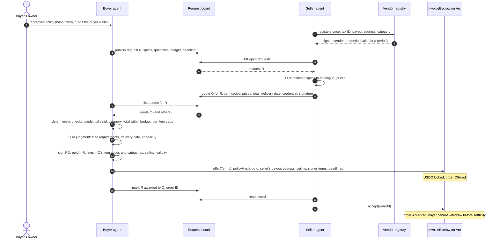
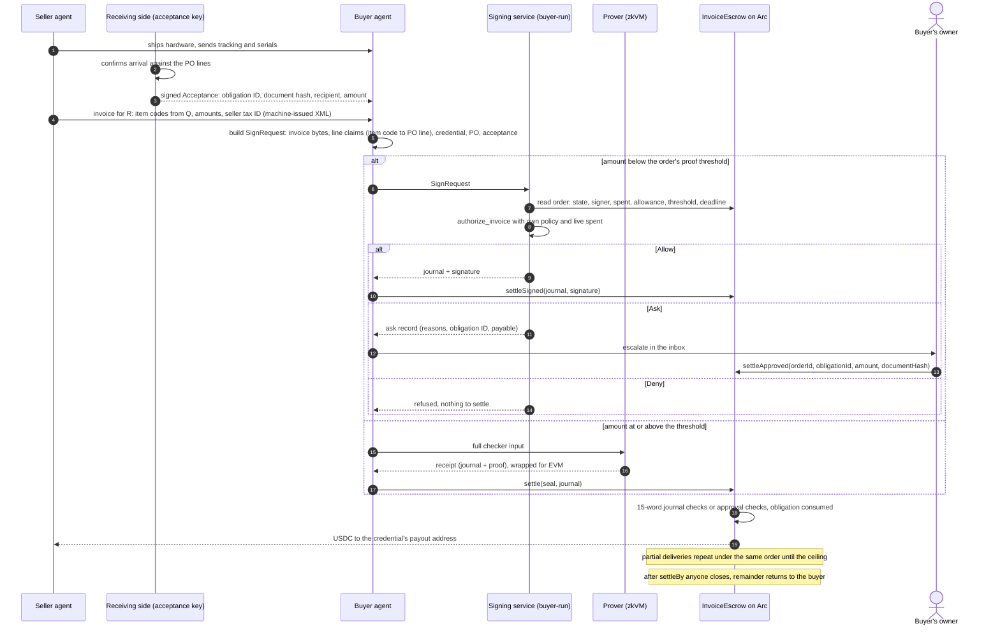

# Use case: automated hardware purchase between agents

Status: 2026-09-27, draft for decision. Written after the conversations of
2026-09-25 and 2026-09-27; §8 lists what is decided and what is still open.

Abbreviations: PO — purchase order; USDC — USD Coin; zkVM — zero-knowledge
virtual machine; LLM — large language model; RFB — Request for Builders;
A2A — Agent-to-Agent protocol; x402 — HTTP 402 payment protocol; ERC-8004 —
draft Ethereum standard for agent identity and reputation registries.

## 1. The case in one paragraph

A company's agent needs hardware for a new project. It publishes a request with
requirements and a budget. A hardware seller's agent finds the request, quotes,
and, once chosen, delivers and invoices. The buyer's money sits in an escrow on
Arc from the moment the order is placed, so the seller ships without demanding
prepayment and the buyer pays only against an invoice that the policy checker
verified: right vendor, right order, right amount, delivery confirmed. No human
touches a normal deal. A human is asked only when the checker cannot decide.

## 2. Actors and what they hold

| Actor | Holds | Trust |
|---|---|---|
| Buyer's owner | Approves the policy once; funds orders; decides escalations | Trusted for their own money |
| Buyer agent | Buyer's operational keys: PO key, relayer wallet; runs the LLM | Untrusted by the system: everything it produces is verified |
| Seller agent | Seller's keys: quote/invoice signing key, payout address, acceptance on chain | Untrusted counterparty |
| Vendor registry | Registry key named in the buyer's policy; signs vendor credentials | Trusted for "who this seller is" |
| Receiving side | Acceptance key named in the policy; confirms delivery | Trusted for "it arrived" (see §8) |
| Signing service | Buyer-run; policy file, signer key, RPC access | Trusted within the order's allowance and threshold |
| Prover | Runs the checker in the zkVM for large invoices | Untrusted; the proof is verified on chain |
| Request board | Database with an API for requests and quotes | Untrusted; carries no money |
| `InvoiceEscrow` on Arc | The USDC | Enforces every bound |

## 3. Components

| Component | Role | Status |
|---|---|---|
| Policy (`InvoicePolicy`) | Category "hardware", registry key, PO key, acceptance key, per-order ceiling, lexicon, denied terms, rule tree incl. `Accepted`; plus the reputation tier table (§3.1) | Existing; tier table new |
| Vendor registry = mnemonik | Identity and reputation oracle. Issues the vendor credential (§3.2) under the registry key named in the policy; scores sellers and buyers from settled payment records; anchors identity in an ERC-8004 registry where one is live | New (mnemonik protocol, parallel work) |
| Vendor credential | Today: scope, recipient, category, validity window (`VendorCredential` in core). To add: reputation tier and score version; signed by the registry key | Existing; tier field is a checker change |
| Request board | Post and list requests; post and list quotes. Messages between agents use A2A envelopes; the board stores them | New |
| Buyer agent | Publishes request, evaluates quotes, derives order terms from the credential's tier (§3.1), signs PO, funds order, receives invoice, builds checker request, relays settlement | New (uses existing tools) |
| Seller agent | Finds requests, quotes, accepts order on chain, issues invoice | New |
| Purchase order | PO ID = request ID; lines = quote item codes; ceiling; validity; signed by the PO key | Existing |
| `InvoiceEscrow` | One deployment for all buyers and sellers; orders keyed by policy hash and PO ID; three settlement paths; `Paid` events are the reputation feed | Existing |
| Acceptance | Obligation ID, document hash, recipient, amount, accepted flag; signed by the acceptance key | Existing |
| Checker (`authorize_invoice`) | Parses invoice, admits claims with evidence, verifies signatures and bindings, evaluates the policy: Allow, Deny, Ask | Existing |
| Signing service | Reads the order from the chain, refuses unless it names its key, signs on Allow | Existing |
| Prover and verifier | Proof path for amounts at or above the threshold | Existing; Groth16 wrap needs Docker |
| Buyer inbox | Lists Ask records with approve and reject | New |
| Reputation indexer | Reads `Paid`, `Closed` and refund events from the escrow and reports them to mnemonik as settled payment records | New (mnemonik side) |

### 3.1 Reputation sets the order terms, the contract enforces them

The escrow already carries per-order `signer`, `signerAllowance` and
`proofThreshold`. The credential's reputation tier picks their values through a
table that lives in the policy, so the mapping is deterministic, versioned with
the policy hash, and never a model decision:

| Tier in credential | `signerAllowance` (share of ceiling) | `proofThreshold` | Meaning |
|---|---|---|---|
| 0, unknown | 0 | 0 | Proofs only; every invoice goes through the zkVM |
| 1, new | 25 % | low | Small invoices by signature, the rest by proof |
| 2, established | 100 % | medium | Signature up to the ceiling, proof above threshold |
| 3, trusted | 100 % | ceiling | Signature for everything, proof never required |

The numbers are placeholders; the shape is the decision (see §8.6). The buyer
agent reads the tier from the credential, looks up the row, and passes the
values in `offer(Terms)`. After `accept` they cannot change. A seller whose tier
drops keeps the terms of open orders and gets tighter terms on the next one.

### 3.2 What the credential contains

Signed by the registry key named in the policy, valid for a period:

- subject: payout address (`recipient`) and category, as today; the seller's
  tax ID hash is added so the invoice's issuer can be matched to the credential
- tier: 0 to 3 as above, and the score version it was derived from
- identity anchor: ERC-8004 agent ID and registry address when available,
  otherwise absent. The escrow and the checker never read it; it is for
  auditors and for other consumers of the score
- issued at, expires at, registry key ID

The checker treats the credential as a Signed fact, exactly as today. If
mnemonik is unavailable, existing credentials keep working until they expire,
and no new orders are opened to unknown sellers. ERC-8004 is cited as the
identity anchor, not depended on: it is a Draft with a Sepolia reference
implementation, and nothing in the payment path needs it.

### 3.3 Feedback loop

Every settlement emits `Paid(orderId, taskId, amount, authenticator,
deliverableHash, evidenceHash)`, where `taskId` is the obligation ID and
`deliverableHash` the document hash. The indexer turns these, plus closes with unspent remainder and
refunds, into payment records for both parties. The seller's record is "paid on
first submission" or "settled only after Ask"; the buyer's record is "acceptance
signed within N days of shipment" or "order closed without acceptance". That
second one is the buyer-fraud signal from the hosting conversation: a buyer who
takes delivery and never signs accumulates it, and sellers see it before
`accept`. Reputation is a pure function of these records; the formula is
mnemonik's and published there.

Where x402 fits: the seller agent may expose paid endpoints (quote, availability)
over x402, and mnemonik may charge per credential or per score query the same
way. Neither touches the escrow.

## 4. Information flow: from request to funded order

## 5. Payment flow: from delivery to settlement

## 6. Order lifecycle on chain

```mermaid
stateDiagram-v2
    [*] --> Offered: buyer funds the ceiling (offer)
    Offered --> Accepted: seller accepts by acceptBy
    Offered --> Closed: buyer cancels, or anyone after acceptBy
    Accepted --> Accepted: settle / settleSigned / settleApproved, one invoice each
    Accepted --> Closed: anyone after settleBy; remainder to buyer
    Closed --> [*]
```

## 7. Documents and how they bind to each other

| Document | Produced by | Key fields | Bound to |
|---|---|---|---|
| Request R | Buyer agent | request ID, specs, quantities, budget, deadline | PO ID = R |
| Vendor credential | Registry | tax ID hash, payout address, category, validity | Policy's registry key |
| Quote Q | Seller agent | R, item codes, prices, total, delivery date, credential, signature | PO lines = Q's item codes |
| Purchase order | Buyer's PO key | poId = R, vendor tax ID, ceiling, lines, validity | Order on chain by (customer, policyHash, poId) |
| Order (on chain) | Buyer agent | policy hash, poId, recipient = credential address, ceiling, signer terms | Journal must match all |
| Acceptance | Receiving side | obligation ID, document hash, recipient, amount | Invoice's obligation ID and hash |
| Invoice-source attestation | Buyer-approved invoice authority | Exact document hash, customer, PO, scope, validity and signature | Mandatory before automatic authorization; does not establish delivery |
| Invoice | Seller agent | number, seller tax ID, order reference = R, lines with Q's item codes, totals | Obligation ID = tax ID + number |
| Journal | Checker | 15 words: policy, chain, escrow, token, recipient, amount, obligation, document, version, window (two words), evidence, poId, ceiling, customer | Verified by the escrow |

Because the quote's item codes flow into the PO and then into the invoice, line
matching in the checker is exact (`PoLine` evidence), and the lexicon path is
only a fallback for an unexpected line such as shipping or insurance.

## 8. Decisions and open points

Decided on 2026-09-27:

- **D1. One submission, RFB-3 framing.** Warrant is the payment and enforcement
  layer, mnemonik is the identity and reputation oracle, A2A carries the board
  messages, x402 is how paid queries are settled. RFB-3 asks for milestone
  payments, reputation scoring and matching in as many words.
- **D2. Vendor registry = mnemonik.** The credential is issued by mnemonik under
  the registry key named in the policy (§3.2). The escrow's trust model does not
  change: the credential is a Signed fact, whoever computes the score.
- **D3. Reputation is enforced through order terms, not through the model.**
  Tier table in the policy, values fixed at `offer` (§3.1).
- **D4. Both sides are scored.** Settlement events feed seller and buyer
  reputation (§3.3). This is the answer to "the client got the VPS and never
  signed": the loss on one order stays bounded by the terms, and the next seller
  sees the record.

Still open:

1. **Who confirms delivery** (step 5.2). Options: a person at the receiving side
   signs; an agent signs from carrier confirmation plus serial numbers; both
   required above a value. For hosted services (a VPS from amnezia.host) the
   proposal is periodic billing instead of an acceptance act: one order per
   month, one obligation per hour or day, the seller stops service when a period
   is not settled. Needs a decision before the seller agent is built.
2. **Payment terms.** Pay on acceptance only, or a deposit at acceptance of the
   order plus the balance on delivery. The escrow can do either; the policy and
   the PO must say which, and the deposit needs an obligation of its own.
3. **The board.** Off chain with an API is enough for the demo; on chain only if
   discoverability across organizations matters more than cost. A2A message
   schema for request, quote and award to be fixed with the mnemonik side.
4. **What the model does.** Seller's spec-to-catalogue match, buyer's quote
   choice, buyer's line-claim mapping. Everything else is deterministic. Confirm
   this is the intended split.
5. **Real data.** The request, quote and invoice are produced by the agents,
   so the demo's documents are real by construction; the hardware catalogue and
   prices should come from a real seller's list. Proposed first seller:
   amnezia.host. Reputation records must come from real settlements; synthetic
   histories are disqualifying under the brief.
6. **Tier table values.** The four rows in §3.1 are placeholders. Decide the
   allowance shares and thresholds, and whether the table is per category.
7. **Score-to-tier boundaries and the score version.** Owned by mnemonik; the
   policy only needs the tier and a version string it can pin.
8. **Credential lifetime and revocation.** Validity period, and whether the
   checker must consult a revocation list or short validity is enough.

## 9. Demo moments

1. Request published; quote arrives within a minute; order funded on Arc.
2. Seller accepts; the buyer's cancel call reverts: funds are committed.
3. Delivery confirmed; invoice settles by signature in well under a second.
4. A second invoice with an added "insurance" line: Ask; the owner approves it
   from the inbox; settles.
5. The same invoice sent again: refused, obligation already paid.
6. An invoice with a changed payout address in its text: paid to the registry
   address anyway.
7. A quote from a seller without a credential: never reaches the order.
8. Order closes at the deadline; the unspent remainder returns.
