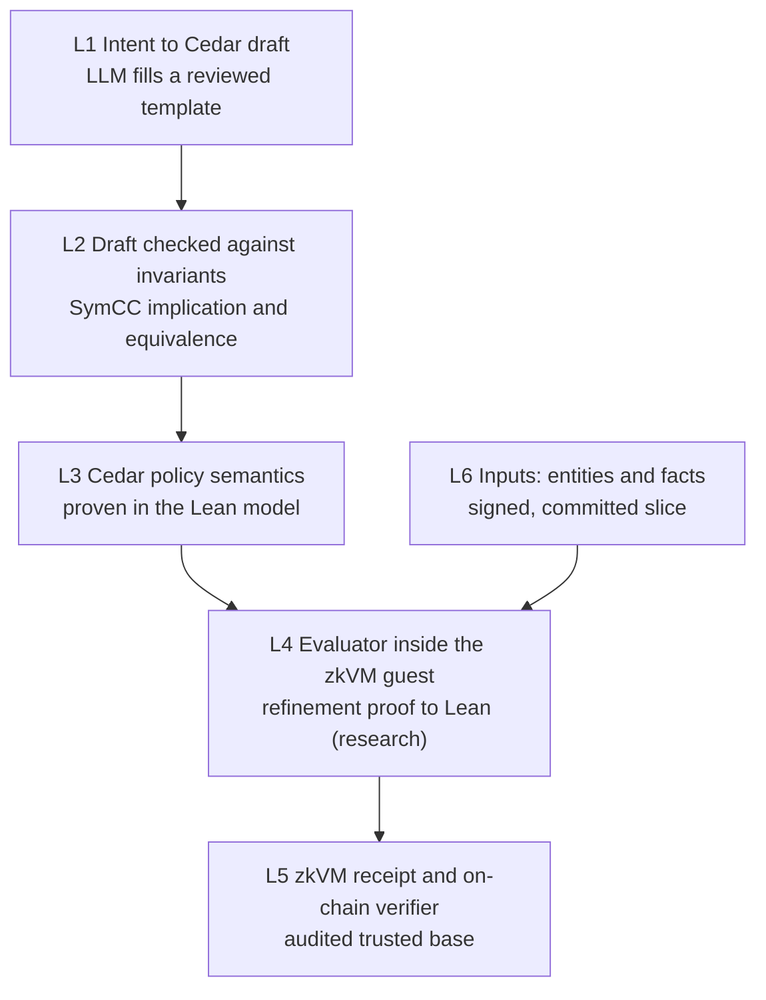

# Proposal: verified chain from intent to on-chain payment

Status: **proposal for a future release.** Nothing in this document is implemented.
The current release is described in [tech-design.md](../tech-design.md).

Abbreviations: LLM — Large Language Model; SMT — Satisfiability Modulo Theories; SymCC — Cedar symbolic compiler; DRT — differential randomized testing; zkVM — zero-knowledge virtual machine; TCB — Trusted Computing Base; A2A — Agent-to-Agent protocol.

## 1. Question and short answer

Question: can we build a chain where (1) a human or agent intent becomes a Cedar policy, (2) the Cedar policy runs in an evaluator inside a prover, and (3) every step is formally verified, so that the multi-agent protocol is fully trustless?

Answer: partly.

- The middle of the chain can be machine-proven with tools that exist now.
- The evaluator inside the prover needs new proof work.
- The step from human intent to a formal policy can be checked, but it can never be proven.
- Some trust stays with keys, real-world facts and the prover stack.

A "totally trustless" protocol is not reachable. A protocol that names each remaining trust assumption, and keeps each one small, is reachable.

## 2. Starting point (current release)

- Policies are JSON decision trees: `all` and `any` nodes over typed leaves such as `amount_at_most`, `vendor_category_in` and `accepted`.
- The owner instantiates a reviewed template with parameters (`warrant-policy instantiate`) and approves the policy hash on-chain.
- No LLM turns intent into a policy.
- A Verus-proven evaluator returns Allow, Ask or Deny. It runs in a RISC Zero guest that also checks secp256k1 registry and reviewer signatures.
- Solidity vault and escrow contracts verify the receipt.
- Mnemonik provides COSE_Sign1 attestations, anchoring, and sign-encrypt-sign for sealed A2A messages.

## 3. Proposed chain

## 4. What is proven today

Cedar's Lean 4 model has machine-checked proofs. They cover the model, not the Rust code that runs in production. Source: [cedar-policy/cedar-spec](https://github.com/cedar-policy/cedar-spec).

| Property | Proven in Lean | Limit that matters for Warrant |
|---|---|---|
| Authorization semantics | A satisfied forbid always denies. Allow needs a satisfied permit. Default is deny. The result does not depend on policy order or duplicates. | The proof is about the model. It lets several parties' policies merge safely, because a forbid from any party wins. |
| Type checking | A well-typed policy returns a value of its type, or only `entityDoesNotExist`, `extensionError` or `arithBoundsError`. | These three errors still occur. Cedar skips a policy that errors, so an erroring forbid fails to deny. Invariants must fail closed. |
| Symbolic analysis (SymCC) | The SMT encoding is sound and complete. Equivalence and implication checks have no false negatives and no false positives. | Needs well-typed, schema-valid policies. Trusts the cvc5 solver and the SMT-LIB emitter. The Rust `cedar-policy-symcc` crate is only DRT-tested. |
| Policy and entity slicing | Authorization on a sound slice equals authorization on the full store. | Says nothing about a slice that an untrusted host supplies. The guest must check completeness. |
| Production evaluator | Not proven. DRT against the Lean model. | A zkVM guest that embeds the Rust `cedar-policy` crate has tested assurance, not proven assurance. |

## 5. Link by link

| Link | Current release | Can it be proven? | What closes the gap |
|---|---|---|---|
| L1 Intent to Cedar draft | Not built. Policies come from reviewed JSON templates. | Never. Intent is informal. | The LLM fills a reviewed Cedar template, not free text. The UI shows a back-translation. The human signs the policy hash. |
| L2 Draft to approved policy | Schema check of template parameters | Yes, with SymCC | Implication check against standing invariants (for example "never permit amount above cap"). Equivalence check against the template instance that the human approves. |
| L3 Policy semantics | JSON decision tree; Verus-proven evaluator | Yes, for the Lean model | Adopt Cedar semantics. Write invariants as guarded permits so that errors fail closed. |
| L4 Evaluator in the prover | Verus-proven evaluator for the JSON decision tree, in a RISC Zero guest | Research | Extend the Verus evaluator to a Cedar subset with a refinement proof to the Lean model. Alternative: compile verified Lean code into the guest. |
| L5 Prover and on-chain verifier | RISC Zero receipts checked by Solidity contracts | Not yet (unverified) | Treat as audited TCB. Track formal verification of RISC Zero and SP1 circuits. Pin the image ID. |
| L6 Inputs | Guest checks registry and reviewer signatures | Signatures: yes. Truth of facts: never. | The guest checks a Merkle proof that the entity slice is complete against a root in a Mnemonik attestation. |

## 6. Residual trust

| Trust that remains | Why proof cannot remove it | Best mitigation |
|---|---|---|
| Intent matches policy | Natural language has no formal meaning to prove against | Constrained templates, back-translation, invariant checks, human signature on the policy hash |
| Prover, circuits, verifier contract | The proof system itself is the TCB | Pinned image IDs, audits, formal verification of the zkVM when available, optional second zkVM |
| Key custody | A stolen key signs valid statements | Short validity windows, revocation, spend caps, hardware keys, multi-party approval above a threshold |
| Real-world facts | A signature shows who made a claim, not that the claim is true | Signed sources only, evidence that the guest re-checks, `unknown` maps to Deny or Ask |
| Anchoring liveness | Arweave or a chain can delay or censor | Several anchors, timeouts that fail closed, retained original signed bytes |

## 7. Roadmap

Each phase is usable on its own. Phases 1 and 2 use proven tools that exist. Phases 3 and 4 need new work; phase 4 is research.

1. **Cedar as the policy language (engineering).** Express the current templates as Cedar templates with a Warrant schema. Run the Rust `cedar-policy` evaluator (DRT-tested) in the guest beside the Verus evaluator, and compare decisions.
   - Exit gate: both evaluators agree on all existing fixtures. Errors fail closed.
2. **Checked intent (engineering).** The LLM selects a Cedar template and fills its parameters. SymCC checks that the result implies the standing invariants and equals the instance that the human approves. The UI shows a back-translation. The human signs the policy hash.
   - Exit gate: an adversarial set of intents in which an invariant check or the human review catches every policy that widens access.
3. **Committed inputs (engineering and proof).** Anchor the policy-set root and the entity root in Mnemonik attestations. The guest checks Merkle inclusion and slice completeness before it evaluates.
   - Exit gate: tests in which the host drops, swaps or replays entities, and the guest rejects every case.
4. **Proven evaluator in the prover (research).** Extend the Verus evaluator to a Cedar subset with a refinement proof to the Lean model, or compile verified Lean code into the guest. Replace the DRT-tested evaluator.
   - Exit gate: a machine-checked refinement for the Cedar subset that Warrant policies use. Track zkVM circuit verification in parallel; it is outside this project's control.

## 8. Open questions

The research for this proposal verified only Cedar's proofs. These topics need their own review before phases 3 and 4 start:

- How far are the RISC Zero, SP1, Jolt and zkSync circuits and verifier contracts formally verified? Which can count as a proven link, not an audited one?
- Can verified Lean code run in a RISC Zero or SP1 guest without a large unverified runtime in the TCB?
- How accurate is LLM translation from intent to Cedar? Which validation pipeline gives measurable assurance?
- Does a Merkle root in a Mnemonik attestation prove slice completeness and freshness, given Cedar's level-based slicing preconditions?

## 9. Sources

- [cedar-policy/cedar-spec](https://github.com/cedar-policy/cedar-spec): Lean model and proofs (`Cedar/Thm/Authorization.lean`, `Verification.lean`, `SymbolicCompilation.lean`, `Slicing.lean`, `Validation/Levels.lean`) and the DRT harness. This is the only source behind section 4.
- [How We Built Cedar (FSE 2024)](https://arxiv.org/abs/2407.01688): states that the Rust evaluator is tested against the model, not proven.
- Background, not used for any claim above: [SP1 formal verification (Ethereum Foundation)](https://zkevm.ethereum.foundation/blog/sp1-fv), [Formal verification of SP1 with Lean](https://blog.succinct.xyz/formal-verification-of-sp1-with-lean/), [Towards a verified Jolt zkVM](https://www.galois.com/articles/towards-a-verified-jolt-zkvm), [Towards formal verification of the first RISC-V zkVM](https://www.nethermind.io/blog/towards-formal-verification-of-the-first-risc-v-zkvm), [SymCert](https://www.amazon.science/publications/symcert-verifying-smt-based-policy-analyses).
