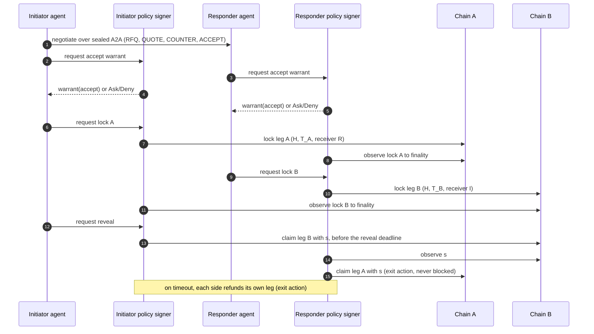
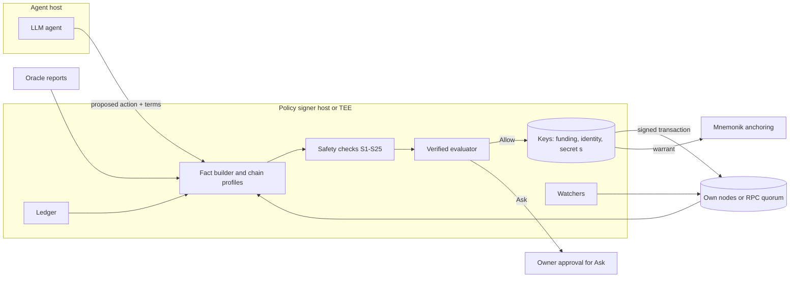

# Warrant for swaps: policy-attested cross-chain settlement

Version 0.2 · 2026-10-06 · Draft. Status: steps W1 and W2 (`swap-verified`,
`swap-core`) are implemented and tested; the signer (W3) and later steps are
planned. See [implementation.md](implementation.md) and [tasks.md](tasks.md).

This document specifies how Warrant authorizes the actions of an agent in an
atomic cross-chain swap. The design is universal. It does not depend on one
settlement engine, one chain or one asset. Each chain enters through a chain
profile (section 8). A chain that cannot supply every obligatory primitive in
that profile is not supported.

Companion documents: [the Warrant whitepaper](../whitepaper.md),
[the evaluator proof](../policy-execution/verified/README.md),
[the technical design](../tech-design.md).
The first integration target is the Flo.tc settlement core, through the
"Agentic Swap Spec v0.1". Mnemonik supplies identity, sealed negotiation and
anchoring.

Abbreviations: A2A — agent to agent; BIP — Bitcoin Improvement Proposal;
CAIP — Chain Agnostic Improvement Proposal; COSE — CBOR Object Signing and
Encryption; CBOR — Concise Binary Object Representation; CSPRNG —
cryptographically secure pseudo-random number generator; EIP — Ethereum
Improvement Proposal; EVM — Ethereum Virtual Machine; HSM — hardware security
module; HTLC — hashed timelock contract; JCS — JSON Canonicalization Scheme
(RFC 8785); KMS — key management service; L1, L2 — layer 1 and layer 2 chains;
LLM — large language model; MEV — maximal extractable value; MTP — median time
past; PDA — program derived address; PSBT — partially signed Bitcoin
transaction; PTLC — point timelocked contract; RPC — remote procedure call;
TCB — trusted computing base; TEE — trusted execution environment;
TRUC — topologically restricted until confirmation.

---

## 1. Summary

An agent negotiates a swap and then moves funds on two chains. The agent uses an
LLM. An LLM can be wrong or under the control of an attacker. Warrant therefore
splits the work:

- The agent **proposes** each action.
- A small **policy signer** decides. It holds the keys. It builds facts, runs a
  verified evaluator and signs only on `Allow`.
- Each decision produces a **warrant**: a signed record of the action, the facts,
  the policy hash and the decision. Mnemonik anchors the record.

The HTLC gives atomicity: either both legs settle or both refund. Warrant adds
authorization: no leg locks unless the owner's policy permits the trade. Warrant
also adds a set of chain-level safety checks. Each of these checks prevents a
known loss of funds in HTLC swaps. Section 7 lists them. They apply even when the
policy permits everything.

## 2. Scope

In scope:

- Two-party atomic swaps with one hashlock and two timelocks.
- Human and agent parties in any combination.
- The actions `accept`, `lock`, `reveal`, `claim` and `refund` (section 3.3).
- Bitcoin, EVM chains and Solana as reference chain profiles. Other chains enter
  through the same profile contract.

Not in scope for version 1:

- Multi-hop routes, partial fills and order books. Discovery is the job of the
  settlement venue.
- Adaptor-signature swaps (PTLC). Section 12 lists them as planned work.
- Price discovery. The policy bounds the price. It does not set the price.
- The HTLC free-option problem. Section 10 bounds it. It does not remove it.

## 3. The universal model

### 3.1 Parties and roles

| Role | Definition |
|---|---|
| Initiator (I) | Generates the secret `s` and the hashlock `H = h(s)`. Locks first. |
| Responder (R) | Locks second, after the initiator lock is final. |
| Owner | The human or organization that approves the policy for one party. |
| Policy signer | The process that holds the keys of one party and enforces its policy. |
| Venue | The settlement engine and discovery service, for example Flo.tc. |

Each party has its own owner, policy and policy signer. No party trusts the
other party's signer. A party trusts the other party's warrant only as far as it
can verify that warrant (section 6.4).

### 3.2 Legs and locks

A swap has two legs. Each leg is a lock on one chain.

```text
Leg {
  chain:      CAIP-2 chain id         e.g. "bip122:000000000019d6689c085ae165831e93"
  asset:      CAIP-19 asset id        e.g. "eip155:1/erc20:0xA0b8...eB48"
  amount:     integer, base units     never a decimal string
  sender:     CAIP-10 account         the party that funds the lock
  receiver:   CAIP-10 account         paid on claim; fixed at lock time
  refund_to:  CAIP-10 account         paid on refund; fixed at lock time
  lock:       Lock
}

Lock {
  contract:    contract identity      script template, contract code hash or program id
  hash_alg:    "sha256"               the only value in version 1
  hashlock:    32 bytes               H = sha256(s)
  preimage_len: 32                    enforced by the lock itself
  timelock:    { kind, value, clock } absolute height, absolute time or relative
  swap_id:     32 bytes               unique per swap; bound in the lock where the chain allows
}
```

Leg A is the initiator's asset on chain A. Leg B is the responder's asset on
chain B. Chain A and chain B can be the same chain.

The CAIP identifiers make the warrant chain-agnostic. A policy names chains,
assets and accounts in one format for every chain.

### 3.3 Actions

| # | Action | Who | Effect | Policy can deny? |
|---|---|---|---|---|
| 1 | `accept` | I and R | Sign the agreed terms (the ACCEPT message) | Yes |
| 2 | `lock` | I, then R | Fund the own leg | Yes |
| 3 | `reveal` | I | Claim leg B, which publishes `s` | Yes, until the deadline |
| 4 | `claim` | R | Claim leg A with `s` | **No** |
| 5 | `refund` | I or R | Recover the own leg after its timelock | **No** |

**Entry actions** (1 to 3) commit value. The policy gates them.

**Exit actions** (4 and 5) recover value. A policy must never block an exit
action. The policy signer performs only the structural checks of section 7 for
them. A policy that tries to deny an exit action is invalid. `validate_policy`
rejects it.

Reason: after a lock, a blocked exit converts a safe swap into a loss. Two
examples:

- The initiator has revealed `s` and claimed leg B. The responder's claim of
  leg A is blocked. After `T_A`, the initiator refunds leg A and keeps both legs.
- A refund is blocked. The funds stay in the lock, or the counterparty claims
  them later with a secret that leaked.

### 3.4 The sequence



---

## 4. The swap warrant

### 4.1 Contents

A warrant authorizes exactly one action for one swap. It binds the
transactions of that action: one transaction, except an ERC-20 lock that needs
an allowance, which binds the ordered pair `approve`, `lock` (section 4.2). Its
payload is a JSON object in JCS canonical form:

```text
SwapWarrant {
  protocol:        "warrant.swap.v1"     domain separator inside the signed payload
  action:          "accept" | "lock" | "reveal" | "claim" | "refund"
  swap_id:         32 bytes, hex
  terms_hash:      blake3(JCS(agreed terms))
  inner_sig_hash:  blake3(signed ACCEPT message)    links negotiation to warrant
  leg:             Leg                    the leg that this action touches; absent for accept
  tx_binding:      TxBinding              absent for accept
  facts:           [Fact]                 every fact the evaluator read, with provenance
  policy_hash:     32 bytes               hash of the approved policy term
  policy_version:  integer
  evaluator_id:    32 bytes               hash of the evaluator build, or "human-review"
  decision:        "allow"                only Allow produces a signed warrant
  reasons:         [string]               fixed reason codes, never model text
  valid_after:     Unix seconds, the policy signer's real time
  valid_until:     Unix seconds, the policy signer's real time
  nonce:           16 random bytes
  prev_warrant:    hash of the previous warrant for this swap and party, or null
}
```

The validity window uses one clock for every action, including `accept`, which
has no leg and spans two chains: the policy signer's real time. A verifier
compares it with its own real time and a stated skew allowance. Chain time
still governs the locks themselves, through the timelocks and S11 to S14.

`Deny` and `Ask` results are records, not warrants. The policy signer stores them
and anchors them. It signs them with a different `protocol` value
(`warrant.swap.decision.v1`). A verifier can never confuse them with an
authorization.

### 4.2 Transaction binding

The warrant binds the exact transaction that the signer signs:

| Chain family | `TxBinding` content |
|---|---|
| Bitcoin | Unsigned transaction id of the PSBT and every BIP 341 sighash that the signer produces. Every signature uses `SIGHASH_DEFAULT` or `SIGHASH_ALL`. |
| EVM | Hash of the unsigned EIP-1559 transaction (chain id, nonce, to, value, data, fees) |
| Solana | Hash of the serialized transaction message |

**The agent proposes. The signer builds or decodes.** The policy signer never
signs an opaque transaction from the agent. It does one of two things:

1. It builds the transaction itself from the structured intent.
2. It fully decodes the proposed transaction and compares it with the intent.

The decoded transaction must do the authorized action and nothing more:

- Bitcoin: the inputs are own coins. The outputs are the HTLC output and own
  change. No other output exists. Every signature commits to all inputs and all
  outputs: the sighash type is `SIGHASH_DEFAULT` (0x00) or `SIGHASH_ALL`
  (0x01). The signer rejects a PSBT that requests `SIGHASH_NONE`,
  `SIGHASH_SINGLE` or `ANYONECANPAY`. With those types another party could
  change the transaction after the signature.
- EVM: one call to the pinned HTLC contract. A token lock can need one earlier
  `approve` transaction. The `lock` warrant then binds both transactions in
  order, `approve` and `lock`; `approve` is not a separate action. The signer
  signs both under the one warrant and broadcasts the lock only after the
  approval confirms. An approval left without its lock grants only the exact
  amount to the pinned HTLC, which moves funds only on a lock call by the
  owner; the signer revokes it when the swap ends without a lock. Where the
  token supports EIP-2612 `permit` or Permit2, the approval and the lock can be
  one transaction instead. That approval is for the exact gross debit of the
  lock. For a normal token, the gross debit is the leg amount. For a token with
  `transfer_fee`, the signer computes the gross debit from the fee parameters
  that it reads on the chain, so that the net amount in the lock equals the
  terms (S8). The signer never signs an unlimited allowance.
- Solana: only the pinned HTLC program, the token program, the associated token
  account program and the compute budget program appear. Two native programs
  are also allowed, each only when the selected mode needs it and each with
  strict argument checks: the System Program `AdvanceNonceAccount` instruction
  as the first instruction, for a durable-nonce refund (section 8.6), with the
  pinned nonce account and authority; and the Ed25519 program, for tier E2
  (section 9), with exactly the warrant message and the warrant key. No other
  instruction exists.

### 4.3 Signing suites

| Suite | Key | Use | Status |
|---|---|---|---|
| COSE_Sign1, EdDSA (Ed25519) | Mnemonik identity of the party | Primary warrant signature; anchored by Mnemonik | Mnemonik signing available now; swap warrant planned |
| EIP-712, secp256k1 | EVM key of the policy signer | Optional second signature for on-chain checks on EVM (section 9) | Planned |
| Ed25519 instruction | Same Ed25519 key | Optional on-chain check on Solana through the Ed25519 program | Planned |

The two keys of one party must be bound to each other by a signed binding
record. Mnemonik plans this binding as "dual-key identity".

### 4.4 Chain of records

For one swap and one party, the records form a hash chain through
`prev_warrant`:

```text
ACCEPT message → warrant(accept) → warrant(lock) → warrant(reveal) → warrant(claim | refund)
```

The policy signer anchors each record through Mnemonik A2A attestation, in the
negotiation `context_id`. An auditor can then answer one question from one
chain of records: why did this trade happen, and did the policy permit it?

---

## 5. Facts

The whitepaper rule applies without change: **a bare assertion from the agent is
never a fact.** Each fact carries its provenance. A fact without valid
provenance is `Unknown`.

### 5.1 Fact classes

| Class | Source | Examples |
|---|---|---|
| Signed facts | An authority that the owner approved signs them | Counterparty identity credential, oracle price report, sanctions list snapshot, signed ACCEPT terms |
| Chain facts | The policy signer observes them on a chain | Lock exists, lock parameters, confirmation depth, chain time, token metadata, contract code hash |
| Derived facts | Deterministic computation from other facts | Notional in the reference currency, timeout gap, reveal deadline, price deviation |
| Ledger facts | The policy signer's own state | Notional spent this period, open swaps, consumed nonces |
| Checked claims | The agent claims, a deterministic checker admits | Rarely needed for swaps. A swap has structured terms, not free text |

### 5.2 The selection invariant for swaps

**Fields that select must never come from the agent or the model. Fields that
quantify can, inside bounds.**

Selecting fields for a swap:

- the receiver and refund accounts;
- the HTLC contract, script template or program;
- the asset identifier and its decimals;
- the hash function and the preimage length;
- the chain identifier.

These come from the policy, from signed facts or from chain facts. The agent
proposes the amount, the price and the timelocks. The rules bound them.

### 5.3 Evidence for chain facts

A chain fact is only as strong as its observation. The chain profile names the
method. The policy names the minimum method for each value band.

| Method | Strength | Notes |
|---|---|---|
| Own full node | Strongest | Bitcoin: own `bitcoind`. EVM: own execution and consensus client. Solana: own RPC node. |
| Light client proof | Strong | Bitcoin: block headers plus a Merkle proof of the transaction. EVM: `eth_getProof` (EIP-1186) against a finalized header from a light client. |
| Quorum of independent RPC providers | Medium | N of M providers must agree on the block hash and the value. |
| One third-party RPC | Weak | Allowed only below a policy value limit. |

A fact records the block hash, the height or slot, the method and the providers.
If the providers disagree, the fact is `Unknown`.

### 5.4 Oracle facts

A price fact needs a signed source. Examples: a signed pull-oracle update
(Pyth, signed through Wormhole), a signed Chainlink Data Streams report, or an
on-chain aggregator read at a finalized block. The fact carries the price, the
confidence interval and the publish time. A stale price or a wide confidence
interval makes the price `Unknown`. The policy then decides, usually `Ask`.

---

## 6. Rules and the decision

### 6.1 The evaluator

The swap evaluator uses the existing Warrant design (whitepaper section 5):

- The rule grammar has `All`, `Any` and atoms. It has no negation. Every atom is
  monotone.
- Each atom is three-valued: true, false or unknown.
- A pessimistic pass maps unknown to false. True means `Allow`.
- An optimistic pass maps unknown to true. False means `Deny`.
- Any other result means `Ask`. The policy signer routes `Ask` to the owner.

The evaluator is a pure function of the rule tree and the facts. It reads no
clock, no network and no state. The policy signer supplies time, chain facts and
ledger facts as inputs. Any verifier can therefore re-run the decision.

### 6.2 Atoms

Generic atoms. Other domains can reuse them.

| Atom | True when |
|---|---|
| `ChainIn(set)` | The leg chain (CAIP-2) is in the set |
| `AssetIn(set)` | The leg asset (CAIP-19) is in the set |
| `CounterpartyIn(set)` | The counterparty identity is in the set, by a signed credential |
| `CounterpartyNotListed(list_hash)` | A signed list snapshot with this hash does not contain the counterparty |
| `NotionalAtMost(ref_ccy, amount)` | The derived notional of the trade is at most the amount |
| `PeriodNotionalAtMost(period, amount)` | Ledger spend in the period plus this trade is at most the amount |
| `OpenSwapsAtMost(n)` | Open swaps of this party, including this one, are at most n |
| `EvidenceAtLeast(method)` | Every chain fact uses at least this observation method |

Swap atoms.

| Atom | True when |
|---|---|
| `PairIn(set)` | The ordered pair (give asset, take asset) is in the set |
| `PriceDeviationAtMost(bps)` | The agreed price is within `bps` of the signed oracle price |
| `TimeoutGapAtLeast(seconds)` | The conservative gap of section 7.3 is at least this value |
| `RevealWindowAtLeast(seconds)` | Time left before the reveal deadline is at least this value |
| `FinalityAtLeast(chain, depth)` | The counterparty lock has this depth or the chain's finalized status |
| `AssetRiskWithin(flags)` | The asset risk flags (section 8.5) are a subset of the allowed flags |
| `ContractPinned` | The lock contract identity equals a contract that the policy pins |
| `CollateralAtLeast(bps)` | The counterparty posted collateral of at least `bps` of the notional |

The obligatory checks of section 7 are **not** atoms. The policy cannot switch
them off. They run before the evaluator. A failure is `Deny` with a fixed reason
code.

### 6.3 Example policy

```json
{
  "all": [
    { "pair_in": [["bip122:…/slip44:0", "eip155:1/erc20:0xA0b8…eB48"]] },
    { "notional_at_most": ["USD", 50000] },
    { "period_notional_at_most": ["P1D", 200000] },
    { "price_deviation_at_most": 50 },
    { "timeout_gap_at_least": 7200 },
    { "finality_at_least": ["bip122:…", 3] },
    { "evidence_at_least": "light_client" },
    { "asset_risk_within": ["freezable_by_issuer"] },
    { "any": [ { "counterparty_in": ["did:key:z6Mk…"] },
               { "notional_at_most": ["USD", 1000] } ] }
  ]
}
```

In words: BTC for USDC only; at most 50,000 USD per deal and 200,000 USD per
day; at most 0.5 % from the oracle price; at least two hours of gap; three
Bitcoin confirmations; light-client evidence; issuer freeze is acceptable; an
unknown counterparty only up to 1,000 USD.

### 6.4 Verifying the counterparty's warrant

Before it locks, a responder can require the initiator's `accept` warrant, and
the reverse. The verifier checks:

1. the signature and the binding to the counterparty identity;
2. `terms_hash` and `inner_sig_hash` against its own copy of the negotiation;
3. the `evaluator_id` against a list of known evaluator builds.

Without the counterparty policy term, the verifier cannot re-run the decision.
It learns only that the counterparty's signer claims `Allow`. A party can
disclose its policy term to the counterparty, or to an auditor only. This is an
owner choice. Section 14 lists it as an open question.

---

## 7. Obligatory safety checks

Each check below prevents a known way to lose funds in an HTLC swap. The policy
signer runs all of them. The policy cannot disable them. Each check is a
deterministic function of facts. A failed check on an entry action gives `Deny`.
A failed check on an exit action stops the signer and alerts the owner.

### 7.1 Hashlock

| ID | Check | Loss it prevents |
|---|---|---|
| S1 | Both legs use the same hash function. Version 1 allows only SHA-256. | A secret that opens one leg and not the other |
| S2 | Both lock scripts or contracts enforce `len(s) = 32` | The initiator uses a long preimage. Chain B accepts it. Chain A rejects it, for example above the 520-byte script element limit of Bitcoin. The responder then cannot claim. |
| S3 | Both legs carry the same `H` | Two unrelated locks |
| S4 | The signer generates `s` with a CSPRNG, uses it for one swap only and never exports it before `reveal` | Secret reuse links swaps and lets an observer claim a second swap |

SHA-256 is the common hash function. Bitcoin script has `OP_SHA256`. EVM chains
have the SHA-256 precompile at address `0x02`. Solana has the `sol_sha256`
system call. Keccak-256 is not available in Bitcoin script. A chain profile that
cannot verify SHA-256 with a length check in its lock is not supported.

### 7.2 Lock parameters

| ID | Check | Loss it prevents |
|---|---|---|
| S5 | The claim pays a receiver fixed at lock time. It never pays the caller or the transaction signer. | Anyone who sees `s` claims the funds |
| S6 | The refund pays a `refund_to` account fixed at lock time | A third party redirects the refund |
| S7 | The lock contract identity matches the pinned identity (section 8.4) | A look-alike contract that never pays out |
| S8 | The observed amount, asset and decimals equal the terms. For tokens with transfer fees, the net amount in the lock equals the terms. | Short payment |
| S9 | The asset identity comes from the chain, not from the counterparty | A fake token with the same symbol |
| S10 | The lock binds `swap_id` where the chain allows it, and the signer keeps a consumed set of swap ids | Replay of one lock or one warrant against a second swap |

### 7.3 Timelocks

Notation: `T_A` is the timelock of leg A (initiator funds, longer). `T_B` is the
timelock of leg B (responder funds, shorter). Each timelock is in the native clock
of its chain.

**S11 — ordering and gap.** The responder requires:

```text
earliest_real(T_A) − latest_real(T_B) ≥ D_observe(B) + D_confirm(A) + D_margin
```

- `latest_real(T_B)`: the latest wall-clock moment at which chain B can still
  accept the initiator's claim.
- `earliest_real(T_A)`: the earliest wall-clock moment at which chain A can
  accept the initiator's refund.
- `D_observe(B)`: time for the responder to see `s` on chain B.
- `D_confirm(A)`: time to get the responder's claim on chain A to finality under
  the profile's worst-case fee and congestion assumption.
- `D_margin`: the policy margin.

The conversion from a chain clock to wall-clock time is **conservative**:

- For a height lock, the earliest real time uses the profile's fastest block
  interval. The latest real time uses the slowest block interval.
- For a time lock, the bounds use the profile's permitted timestamp drift. On
  Bitcoin, a time lock compares with the median time past of 11 blocks (BIP 113).
  That clock lags wall time by about one hour. A block timestamp can also run up
  to two hours ahead.

The agent never computes this gap. The policy signer computes it from the
profile and the observed chain state.

**S12 — the initiator's reveal deadline.** The initiator broadcasts the claim on
chain B only when:

```text
now_real + D_confirm(B) + D_margin ≤ earliest_real(T_B)
```

The claim must also be final before `T_B`. If the reveal confirms late, the
responder can refund leg B and also claim leg A with the published `s`. The
initiator then loses both legs. After the deadline, the initiator must not
reveal. The initiator waits and refunds leg A after `T_A`.

**S13 — the responder's entry window.** The responder locks leg B only when:

- the initiator lock is final (S14);
- the remaining time on leg A still satisfies S11 for the `T_B` that the
  responder is about to use.

**S14 — finality before dependence.** No party acts on a counterparty lock until
the lock has the profile's finality for the policy value band. A reorganization
can remove a lock that a party already relied on.

### 7.4 Liveness and exits

| ID | Check | Loss it prevents |
|---|---|---|
| S15 | The signer holds a native fee reserve on every chain that it must touch, for a claim and a refund at the worst-case fee. It checks this before `lock`. | The claim or refund cannot pay its fee in time |
| S16 | A watcher runs for each open swap. The responder watches chain B for `s`, in the mempool and in blocks. Each party watches its own refund time. | A missed claim or a missed refund |
| S17 | The signer prepares the refund at lock time where the chain allows it (section 8.6) | The refund depends on the signer being available later |
| S18 | Exit actions are never subject to the policy (section 3.3) | A policy change or a fault blocks recovery of own funds |
| S19 | The signer can raise the fee of a pending claim or refund (section 8.6) | A congested or pinned transaction misses its deadline |

### 7.5 Authorization integrity

| ID | Check | Loss it prevents |
|---|---|---|
| S20 | The warrant binds chain id, contract, swap id, nonce and validity window | Replay on another chain, contract or swap |
| S21 | The signer consumes each warrant once | Double use of one authorization |
| S22 | The policy version only increases. The signer rejects an older policy hash. | Rollback to a weaker policy |
| S23 | The `evaluator_id` equals the pinned evaluator build | A changed evaluator |
| S24 | The decoded transaction matches the warrant exactly (section 4.2) | A valid warrant on a different transaction |
| S25 | The ledger state that feeds ledger facts has a monotonic counter and survives restart. Lost state gives `Unknown`. | A reset of the daily limit by a restart |

---

## 8. Chain profiles and blockchain primitives

### 8.1 The profile contract

A chain profile is a small adapter. It is part of the TCB. The owner pins the
profile hash in the policy. A profile supplies:

| Item | Obligatory | Purpose |
|---|---|---|
| CAIP-2 chain id and network kind (mainnet or test) | Yes | Binding (S20); mainnet guard |
| Lock template with SHA-256 and a 32-byte preimage check | Yes | S1, S2 |
| Claim to a fixed receiver, refund to a fixed account | Yes | S5, S6 |
| Timelock kinds with clock bounds (fastest and slowest block interval, timestamp drift) | Yes | S11, S12 |
| Finality rule and observation methods | Yes | S14, section 5.3 |
| Contract identity derivation | Yes | S7 |
| Asset identity and risk flag reader | Yes | S8, S9, section 8.5 |
| Transaction decoder | Yes | S24 |
| Fee model, worst-case fee and fee-raising method | Yes | S15, S19 |
| Prepared refund method or permissionless refund | Yes, one of the two | S17 |
| Swap id binding in the lock | Useful | S10 |
| Cooperative key-path spend | Useful | Privacy and lower fees |
| Private transaction submission | Useful | Less griefing around the reveal |
| On-chain signature check for warrants | Useful | Enforcement tier E2 (section 9) |
| Co-signature account (multisig, smart account) | Useful | Enforcement tier E1 (section 9) |

### 8.2 Hashlock and timelock primitives

| Primitive | Bitcoin | EVM | Solana |
|---|---|---|---|
| Lock form | Taproot output (BIP 341). Claim leaf and refund leaf in tapscript (BIP 342). | HTLC contract, one swap per `swap_id` | HTLC program, one escrow PDA per `swap_id` |
| SHA-256 | `OP_SHA256` | Precompile `0x02` | `sol_sha256` system call |
| Length check | `OP_SIZE 32 OP_EQUALVERIFY` before `OP_SHA256` | Preimage parameter typed `bytes32` | Preimage argument typed `[u8; 32]` |
| Claim leaf / function | `OP_SIZE 32 OP_EQUALVERIFY OP_SHA256 <H> OP_EQUALVERIFY <receiver> OP_CHECKSIG` | `claim(swap_id, s)` pays the stored receiver | `claim` pays the stored receiver token account |
| Absolute timelock | `OP_CHECKLOCKTIMEVERIFY` (BIP 65): height below 500,000,000, else time against MTP (BIP 113) | `block.timestamp` | Clock sysvar `unix_timestamp` |
| Relative timelock | `OP_CHECKSEQUENCEVERIFY` (BIP 112, BIP 68) | Not native | Not native |
| Clock risk | MTP lags about 1 hour; block time can lead by up to 2 hours; block interval varies widely | L1: fixed 12-second slots. L2: the sequencer sets time within its rules. On some L2s, `block.number` follows L1, so use time. | `unix_timestamp` is a stake-weighted estimate and can drift; slot time varies |
| Internal key | Unspendable point (BIP 341 NUMS), or a MuSig2 aggregate (BIP 327) for a cooperative key-path spend | — | — |
| Swap id binding | `H` is unique per swap (S4), so `H` binds the swap | Contract storage keyed by `swap_id` | PDA seeds include `swap_id` |

### 8.3 Finality and observation

| Chain | Finality rule | Notes |
|---|---|---|
| Bitcoin | `k` confirmations; `k` grows with the value band | Probabilistic. A Merkle proof shows inclusion, not that the output is unspent. The watcher tracks spends. |
| Ethereum L1 | `finalized` block tag | About two epochs (about 13 minutes). `safe` is weaker. |
| Optimistic L2 (OP Stack, Arbitrum) | Batch posted to L1 and the L1 block finalized | A sequencer confirmation is soft. A policy can accept it only below a value limit. |
| Other EVM L1 | Per profile | The profile documents the consensus finality. |
| Solana | `finalized` commitment | `confirmed` is optimistic confirmation. A policy can accept it only below a value limit. |

### 8.4 Contract identity

| Chain | How the signer proves that the lock is the pinned HTLC |
|---|---|
| Bitcoin | Re-derive the Taproot output from the template, `H`, both keys and `T`. Compare the derived `scriptPubKey` (bech32m, BIP 350) with the observed output. |
| EVM | The address is in the pinned set and `EXTCODEHASH` (EIP-1052) equals the pinned code hash. Reject a proxy (EIP-1967 implementation slot set) unless the policy pins its admin and implementation. |
| Solana | The program id is in the pinned set. The upgrade authority in `ProgramData` is none or a pinned account. The escrow account is the PDA from the expected seeds, is owned by the program and has the expected discriminator. |

### 8.5 Asset identity and risk flags

The profile reads the asset from the chain: the token contract or mint, the
token program and the decimals. It never takes them from the counterparty. It
then reports a set of universal risk flags:

| Flag | Bitcoin | EVM examples | Solana examples | Effect on a swap |
|---|---|---|---|---|
| `freezable_by_issuer` | — | Issuer blacklist (common in stablecoins) | Mint freeze authority set | The issuer can freeze the escrow, so the claim fails |
| `seizable_by_issuer` | — | Admin transfer function | Token-2022 permanent delegate | The issuer can move funds out of the escrow |
| `pausable` | — | Pausable token | Token-2022 pausable extension | Claim and refund can stop for a time |
| `upgradeable` | — | Token behind a proxy | Mint authority or program upgrade authority set | Behaviour can change during the swap |
| `transfer_fee` | — | Fee-on-transfer token | Token-2022 transfer fee extension | The net amount differs from the gross amount (S8) |
| `transfer_hook` | — | ERC-777 style hooks | Token-2022 transfer hook | Foreign code runs on claim and can block it |
| `rebasing` | — | Rebasing token | Interest-bearing or scaled display amount | The amount in the escrow changes |
| `confidential_amount` | — | — | Token-2022 confidential transfer | The signer cannot verify the amount |
| `non_transferable` | — | Soulbound token | Token-2022 non-transferable | The claim cannot succeed |

`confidential_amount` and `non_transferable` always give `Deny` (section 7). The
policy decides each other flag through `AssetRiskWithin`. Many real stablecoins
carry `freezable_by_issuer`. A policy that trades them must allow that flag
knowingly.

### 8.6 Fees, fee raising and prepared refunds

| Primitive | Bitcoin | EVM | Solana |
|---|---|---|---|
| Fee model | Fee rate per virtual byte | EIP-1559 base fee and priority fee | Base fee and priority fee (compute budget instructions) |
| Raise the fee | Replace-by-fee (BIP 125) or child-pays-for-parent | Replace with the same nonce and a higher fee | No replacement. Resubmit with a new recent blockhash and a higher priority fee. |
| Pinning resistance | TRUC (version 3) transactions (BIP 431) and pay-to-anchor outputs, subject to node policy | — | — |
| Queue hazard | — | A stuck transaction with a lower nonce blocks the claim. Use a dedicated account per role, or clear the queue before the reveal. | A recent blockhash expires after about 150 blocks |
| Prepared refund | Sign the refund transaction at lock time with `nLockTime = T`. Raise its fee later through child-pays-for-parent. | Prefer a contract where anyone can trigger `refund` to the fixed `refund_to`. A watchtower then needs no key. | A durable nonce account permits a pre-signed refund. Otherwise use a permissionless refund instruction. |
| Private submission | Direct submission to miners, where available | Private relays | Direct submission to the leader, where available |

### 8.7 Signing interface

| Chain | What the policy signer receives and signs |
|---|---|
| Bitcoin | A PSBT (BIP 174 or BIP 370). The signer computes the BIP 341 sighash itself. It never signs a sighash that the agent supplies. |
| EVM | A typed transaction (EIP-2718, EIP-1559) with the EIP-155 chain id. Token allowances are exact. EIP-2612 `permit` or Permit2 is acceptable with an exact amount and a short deadline. |
| Solana | A transaction message. The signer resolves address lookup tables and decodes every instruction before it signs. |

### 8.8 Adding a chain

A new chain, for example a chain that a venue already supports, enters only when
its profile passes this checklist:

1. Every obligatory item of section 8.1 has an implementation and a test.
2. The lock template has a regression test for each check S1 to S10.
3. The clock bounds come from measured data, with a source and a date.
4. A fault test shows a correct refund after a missed claim.
5. A reviewer other than the author approves the profile. The policy pins its
   hash.

A missing obligatory item makes `validate_policy` reject any policy that names
the chain.

---

## 9. Where the warrant is enforced

No HTLC reads a warrant. The warrant is enforced only where a key refuses to sign
without it. The enforcement tier states which keys refuse.

| Tier | Mechanism | Protects against | Bitcoin | EVM | Solana | Status |
|---|---|---|---|---|---|---|
| E0 | The policy signer is the only holder of the funding key. The agent holds no key. | A wrong or manipulated LLM; prompt injection | Yes | Yes | Yes | Planned. **Required minimum.** |
| E1 | Funds sit in a two-party account: owner key plus policy signer key. The policy signer co-signs only with a warrant. | Theft of one host or one key | MuSig2 (BIP 327) or FROST (RFC 9591) key, or a 2-of-2 tapscript | Safe multisig with a guard, ERC-4337 or ERC-7579 account | Squads multisig, or a program-owned vault | Planned |
| E2 | A wrapper contract checks the warrant signature before it calls the HTLC | Theft of the funding key, when the warrant key lives in a separate HSM or host | Not possible: no general message-signature opcode | EIP-712 with `ecrecover`; P-256 where a precompile exists. No Ed25519 precompile. | Ed25519 program through instruction introspection | Planned, optional |
| E3 | The wrapper contract checks a zkVM proof of the evaluator run | As E2, and the policy stays private | Not possible | The existing Warrant RISC Zero path | Not planned | Available now for invoices only. Not recommended for swaps. |

Recommendation: start with E0. Add E1 for high-value accounts. E2 and E3 change
the settlement contracts. A venue whose rule is "one settlement engine, no
contract change" cannot use them without a separate decision.

Bitcoin legs can reach at most E1. A policy that needs E2 for every leg excludes
Bitcoin.

---

## 10. Where the code runs



- The **policy signer** is a separate process with its own operating-system user,
  or a TEE. The agent talks to it through one local interface. The agent never
  sees a key or the secret `s`.
- The **evaluator** is native Rust inside the policy signer. A WASM build of the
  same source serves verifiers: the counterparty (section 6.4) and the audit view.
- **Keys** live in an HSM, a KMS or the TEE where possible. The signer requests
  signatures. It never exports the key.
- **Watchers** live in the policy signer process. They must run for the full
  life of each open swap.

The verified evaluator is the smallest part of the TCB. The fact builder, the
chain profiles, the safety checks and the transaction decoder are larger. A
proof of the evaluator does not cover them (section 11).

---

## 11. Threats

| Threat | Mitigation |
|---|---|
| Prompt injection in negotiation messages | The model only proposes. Selecting fields never come from the model (section 5.2). The evaluator decides. |
| Hallucinated or wrong terms | Terms come from the signed ACCEPT message. The signer recomputes notional and price deviation. |
| Agent tries to sign a different transaction | The signer builds or fully decodes the transaction (S24) |
| Agent key theft | E0: the agent has no key. E1: one stolen key is not enough. |
| Policy signer host compromise | E1 limits the loss to the other key holder's approval. E2 adds a contract check on EVM and Solana. |
| Long or wrong preimage | S1, S2 |
| Late reveal | S12 |
| Counterparty lock removed by a reorganization | S14 |
| Look-alike contract or fake token | S7, S9 |
| Issuer freezes or seizes the escrowed asset | Risk flags (section 8.5) and the policy |
| Fee spike or transaction pinning before a deadline | S15, S19, the margins in S11 and S12 |
| A lying RPC provider or an eclipse attack | Section 5.3. Disagreement gives `Unknown`. |
| Clock manipulation near a timelock | Conservative clock bounds in the profile (S11) |
| Warrant replay | S10, S20, S21 |
| Policy rollback | S22 |
| Evaluator substitution | S23 |
| Daily-limit reset through a restart | S25 |
| The HTLC free option: the second mover waits for a price move | Short windows, `CollateralAtLeast`, and a reputation penalty at the venue. This is reduced, not removed. |
| Secret leak before the reveal | S4. The secret stays in the signer. Logs, prompts and transcripts never contain it. |

---

## 12. What is proved, tested or assumed

| Part | Target status | Method |
|---|---|---|
| Evaluator: `evaluate3` returns `Allow` only if every completion of unknowns satisfies the rule | Proved | Verus, as for the invoice evaluator |
| Timeout arithmetic: the clock conversion is conservative and the S11 inequality is computed correctly | Proved (target) | Verus over integer bounds; small and closed |
| Safety checks S1 to S25 | Tested | One negative test per check; mutation tests on each check |
| Chain profiles and transaction decoders | Tested | Regression tests on regtest, local EVM and local Solana validators; fault injection (section 13.3) |
| Cryptographic libraries, node software, HSM or KMS | Assumed | Pinned versions |
| The chains' consensus and the clock bounds in the profile | Assumed | Measured data with a source and a date |
| Translation of the owner's intent into a rule tree | Assumed | The owner reviews and approves the exact rule tree |

Status on 2026-10-06: the evaluator, the timeout arithmetic and their proofs
exist (`swap-verified`), and so do the safety checks, the chain profiles and the
transaction decoders, with their tests (`swap-core`). The proof covers the
evaluator and the arithmetic only. See [implementation.md](implementation.md)
section 5 for the results.

---

## 13. Code layout and plan

### 13.1 Current layout of `policy-execution` (available now)

| Crate | Contents | Depends on |
|---|---|---|
| `verified` (`warrant-verified-policy`) | `Rule`, `Facts`, `Facts3`, `evaluate`, `Decision`, Verus proofs | `vstd`, optional `serde` |
| `core` (`warrant-policy`) | Policy validation, evidence checks, invoice parser, solver checks, the 12/15-word journals | `verified`, `sha2`, `bincode`, `k256` |
| `methods` | RISC Zero guests | `core`, `risc0-zkvm` |
| `host` | Prover host, signer service, tools | `core`, `methods`, `risc0-zkvm` |
| `contracts` | Escrows and vault that pin a guest image id | — |

The evaluator is already separate from the zkVM code. `core` and `verified` do
not depend on RISC Zero. A policy signer can use them without the zkVM.

There is one coupling to avoid. The invoice guest compiles `core` and `verified`.
`InvoiceEscrow` and the vault store the guest `imageId` as an immutable value. A
change to `Rule` in `verified` therefore changes the image id. That change
needs a new escrow deployment and new receipts for the invoice product.

### 13.2 Layout for swaps (`swap-verified` and `swap-core` implemented; `swap-signer` planned)

Do not add swap atoms to the existing `Rule`. Add three crates:

| Crate | Contents | Depends on | Does not depend on |
|---|---|---|---|
| `swap-verified` | `SwapRule`, `SwapFacts3`, `evaluate3`, timeout arithmetic, Verus proofs | `vstd`, optional `serde` | `k256`, RISC Zero, Mnemonik |
| `swap-core` | Chain profile interface, fact builder, safety checks S1 to S25, warrant payload (JCS), transaction decoders | `swap-verified`, chain parsing libraries | RISC Zero, Mnemonik, network clients |
| `swap-signer` | The policy signer binary: keys, watchers, ledger, RPC and node clients, Ask queue, anchoring | `swap-core`, `mnemonic-core` (COSE, sealed A2A, anchoring), KMS adapters | RISC Zero |

Rules for the layout:

- The dependency graph is one-way: `swap-signer` → `swap-core` → `swap-verified`.
- Only `swap-signer` uses the network, the clock and the keys.
- `swap-verified` and `swap-core` build for `wasm32` so that verifiers can re-run a
  decision. A build test must confirm that `vstd` compiles for `wasm32`.
- The swap crates stay in the `policy-execution` workspace because Verus and
  `vstd` need its pinned toolchain. The Mnemonik monorepo does not take `vstd`
  as a dependency. Only `swap-signer` joins the two.
- Extract a shared generic evaluator only when a third domain appears. A generic
  proof costs more, and the extraction moves the invoice image id.

### 13.3 Plan and acceptance

| Step | Work | Acceptance |
|---|---|---|
| W0 | Review this specification. Decide questions 1 to 3 of section 14. | Owner sign-off; schemas frozen |
| W1 | `swap-verified`: atoms, evaluator, timeout arithmetic, proofs | Verus passes with `--no-cheating`; every deliberate mutation rejected, including "Ask treated as Allow" |
| W2 | `swap-core`: Bitcoin, EVM and Solana profiles; checks S1 to S25 | One failing test per check without the check; fixtures for each risk flag |
| W3 | `swap-signer` at tier E0: keys, watchers, ledger, warrants anchored through Mnemonik | Two local agents complete a swap on regtest, a local EVM node and a local Solana validator |
| W4 | Venue adapter, for example the Flo.tc `UserSDK` | Testnet swap between two agents; secret-hygiene audit of logs, prompts and transcripts |
| W5 | Tier E1 co-signing; external security review | Review closed; capped mainnet pilot |

Fault-injection tests for W2 to W4:

1. a 33-byte preimage on one leg;
2. a reveal after the deadline;
3. a reorganization that removes the counterparty lock (`invalidateblock` on regtest);
4. a fee spike and a stuck lower-nonce transaction before a claim;
5. RPC providers that disagree;
6. a fake token with the same symbol; a proxy HTLC; a mint with a permanent delegate;
7. a proposed transaction with one extra output or one extra instruction;
8. a replayed warrant; a rolled-back policy version;
9. a signer restart during an open swap, with ledger state and watchers restored;
10. an initiator outage past the reveal deadline: the initiator does not reveal and
    refunds leg A after `T_A`; the responder refunds leg B after `T_B`.

---

## 14. Open questions

1. **Policy disclosure.** Does a party show its policy term to the counterparty,
   only to an auditor, or to nobody (section 6.4)?
2. **Key custody.** HSM, KMS or TEE for the policy signer; the rotation procedure
   for the funding key and the identity key.
3. **DSL.** The swap mini-DSL of this document, or a Cedar-style language later.
4. **Clock bounds.** Who measures the block-interval and drift bounds for each
   profile, and how often.
5. **Oracle.** The price source for each pair, and the result when the source is
   missing: `Ask` or `Deny`.
6. **Decision records.** Anchor `Deny` and `Ask` records sealed, so that only the
   party and its auditor can read them, or keep them local.
7. **Tier E1 on Bitcoin.** MuSig2 or FROST, and the maturity of the tools.
8. **Version 2.** Adaptor signatures (PTLC) remove the shared hash between the
   legs and improve privacy. A swap across curves (Ed25519 and secp256k1) then
   needs a cross-curve discrete-logarithm equality proof. Lightning legs are a
   related extension.

---

## 15. References

Bitcoin (https://github.com/bitcoin/bips): BIP 65 (`OP_CHECKLOCKTIMEVERIFY`),
BIP 68 and BIP 112 (relative timelocks), BIP 113 (median time past), BIP 125
(replace-by-fee), BIP 174 and BIP 370 (PSBT), BIP 327 (MuSig2), BIP 340 to 342
(Schnorr, Taproot, tapscript), BIP 350 (bech32m), BIP 431 (TRUC transactions).

Ethereum (https://eips.ethereum.org): EIP-155 (chain id), EIP-712 (typed data
signing), EIP-1052 (`EXTCODEHASH`), EIP-1186 (`eth_getProof`), EIP-1559 (fee
market), EIP-1967 (proxy slots), EIP-2612 (`permit`), EIP-2718 (typed
transactions), ERC-4337 (account abstraction), ERC-7579 (modular accounts),
RIP-7212 and EIP-7951 (P-256 signature verification).

Solana (https://solana.com/docs): Clock sysvar, commitment levels, durable
nonces, the Ed25519 program, the upgradeable loader, Token-2022 extensions.

Cross-chain identifiers (https://chainagnostic.org): CAIP-2 (chain id), CAIP-10
(account id), CAIP-19 (asset id).

Formats and protocols: RFC 8785 (JCS), RFC 9052 (COSE), RFC 9591 (FROST),
RFC 6234 (SHA-256).

Background: T. Nolan, atomic cross-chain trading (2013); M. Herlihy, "Atomic
Cross-Chain Swaps", PODC 2018; G. Necula, "Proof-Carrying Code", POPL 1997.
