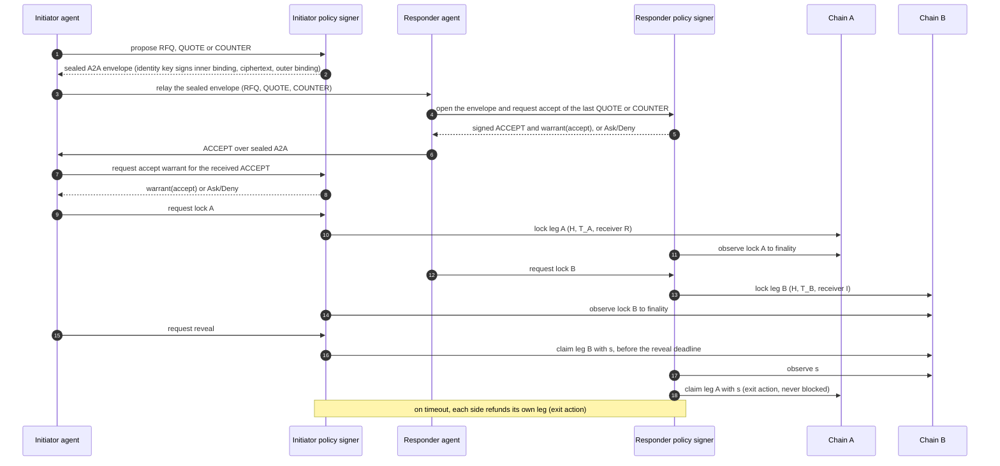
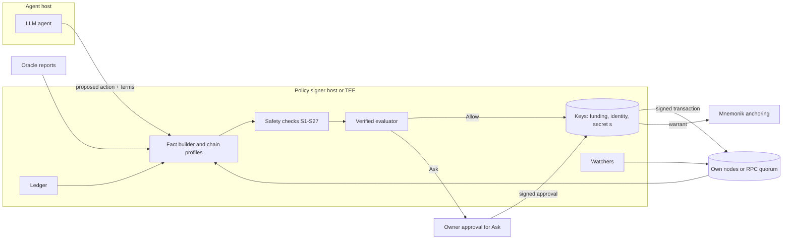

# Warrant for swaps: policy-attested cross-chain settlement

Version 0.3 · 2026-10-07 · Draft. Status: steps W1 and W2 (`swap-verified`,
`swap-core`) are implemented and tested against version 0.2 of this
specification. Version 0.3 adds requirements from later reviews; section 13.4
lists what the code does not implement yet. The signer (W3) and later steps are
planned. See [implementation.md](implementation.md) and [tasks.md](tasks.md).

This document specifies how Warrant authorizes the actions of an agent in an
atomic cross-chain swap. The design is universal. It does not depend on one
settlement engine, one chain or one asset. Each chain enters through a chain
profile (section 8). A chain that cannot supply every obligatory primitive in
that profile is not supported.

Companion documents: [the Warrant whitepaper](../whitepaper.md),
[the evaluator proof](../policy-execution/verified/README.md),
[the earlier technical design (child-wallet proof of concept)](../tech-design.md).
The first integration target is the Flo.tc settlement core, through the
"Agentic Swap Spec v0.1". Mnemonik supplies identity, a generic signed sealed
message channel and
anchoring.

Abbreviations: A2A — agent to agent; BIP — Bitcoin Improvement Proposal;
CAIP — Chain Agnostic Improvement Proposal; COSE — CBOR Object Signing and
Encryption; CBOR — Concise Binary Object Representation; CSPRNG —
cryptographically secure pseudo-random number generator; EIP — Ethereum
Improvement Proposal; EVM — Ethereum Virtual Machine; HSM — hardware security
module; HTLC — hashed timelock contract; JCS — JSON Canonicalization Scheme
(RFC 8785); KMS — key management service; L1, L2 — layer 1 and layer 2 chains;
LLM — large language model; MTP — median time
past; PDA — program derived address; PSBT — partially signed Bitcoin
transaction; PTLC — point timelocked contract; RPC — remote procedure call;
TCB — trusted computing base; TEE — trusted execution environment;
TRUC — topologically restricted until confirmation; ASCII — American Standard Code for
Information Interchange; CVE — Common Vulnerabilities and Exposures; DSL —
domain-specific language; ERC — Ethereum Request for Comments; FROST — Flexible
Round-Optimized Schnorr Threshold signatures; NUMS — nothing up my sleeve; RFQ —
request for quote; SPL — Solana Program Library; UTC — Coordinated Universal Time;
WASM — WebAssembly; zkVM — zero-knowledge virtual machine.

---

## 1. Summary

An agent negotiates a swap and then moves funds on two chains. The agent uses an
LLM. An LLM can be wrong or under the control of an attacker. Warrant therefore
splits the work:

- The agent **proposes** each action.
- A small **policy signer** decides. It holds the keys. It builds facts, runs a
  verified evaluator and signs only on `Allow`.
- Each `Allow` decision produces a **warrant**: a signed record of the action,
  the facts, the policy hash and the decision. Mnemonik anchors the warrant.
  `Deny` and `Ask` produce separate decision records (section 4.1).

The HTLC gives atomicity: either both legs settle or both refund. Warrant adds
authorization: no leg locks unless the owner's policy permits the trade. Warrant
also adds a set of chain-level safety checks. Each of these checks prevents a
known loss of funds in HTLC swaps. Section 7 lists them. They apply even when the
policy permits everything.

## 2. Scope

In scope:

- Two-party atomic swaps with one hashlock and two timelocks.
- Human and agent parties in any combination.
- The actions `accept`, `lock`, `reveal`, `claim` and `refund` (section 3.3).
- Bitcoin, EVM chains and Solana as reference chain profiles. Other chains enter
  through the same profile contract.

Not in scope for version 1:

- Multi-hop routes, partial fills and order books. Discovery is the job of the
  settlement venue.
- Adaptor-signature swaps (PTLC). Section 14, question 8, lists them as planned work.
- Price discovery. The policy bounds the price. It does not set the price.
- The HTLC free-option problem. Section 11 and the `CollateralAtLeast` atom
  (section 6.2) bound it. They do not remove it.

## 3. The universal model

### 3.1 Parties and roles

| Role | Definition |
|---|---|
| Initiator (I) | Generates the secret `s` and the hashlock `H = h(s)`. Locks first. |
| Responder (R) | Locks second, after the initiator lock is final. |
| Agent | The LLM process that negotiates and proposes actions for one party. It holds no key and no funds. |
| Owner | The human or organization that the agent acts for. It owns the funds and the keys, and approves the policy. |
| Policy signer | The owner's component that holds the owner's keys and enforces the owner's policy. It runs in the owner's environment (section 10.1). |
| Venue | The settlement engine and discovery service, for example Flo.tc. |

Each party has its own owner, policy and policy signer. "Party" means the owner
with its agent and its policy signer. Funds never move to the agent or to a third
party; they stay at the owner's address until a lock. No party trusts the
other party's signer. A party trusts the other party's warrant only as far as it
can verify that warrant (section 6.4).

### 3.2 Legs and locks

A swap has two legs. Each leg is a lock on one chain.

```text
Leg {
  chain:      CAIP-2 chain id         e.g. "bip122:000000000019d6689c085ae165831e93"
  asset:      CAIP-19 asset id        e.g. "eip155:1/erc20:0xA0b8...eB48"
  amount:     integer, base units     JSON carries it as a string of decimal digits, never a fraction
  sender:     CAIP-10 account         the party that funds the lock
  receiver:   CAIP-10 account         paid on claim; fixed at lock time
  refund_to:  CAIP-10 account         paid on refund; fixed at lock time
  lock:       Lock
}

Lock {
  contract:    contract identity      script template id, contract address or program id
  hash_alg:    "sha256"               the only value in version 1
  hashlock:    32 bytes               H = sha256(s)
  preimage_len: 32                    enforced by the lock itself
  timelock:    { kind, value }        kind: height | time | relative_blocks | relative_seconds
  swap_id:     32 bytes               unique per swap
  lock_id:     32 bytes               sha256(swap_id ‖ leg ‖ sender); keys the lock on chain
  claim_key:   32-byte x-only key     Bitcoin only; bound in the terms
  refund_key:  32-byte x-only key     Bitcoin only; bound in the terms
}
```

Leg A is the initiator's asset on chain A. Leg B is the responder's asset on
chain B. Chain A and chain B can be the same chain.

Each lock has its own key, `lock_id`. In `lock_id`, `leg` is one byte: `0x41` for
leg A and `0x42` for leg B. `sender` is the chain-native address bytes that the
lock sees, not the CAIP-10 string. Each chain profile states this byte form,
including the form for Bitcoin. The EVM storage key and the Solana escrow
seeds use `lock_id`, never `swap_id` alone. The contract or program derives the
key from the funding sender, so a third party cannot take the key first. The two
legs of a same-chain swap therefore cannot collide.

Version 1 allows a relative timelock on leg A only. Leg B always uses an absolute
timelock (section 7.3).

The CAIP identifiers make the warrant chain-agnostic. A policy names chains,
assets and accounts in one format for every chain.

### 3.3 Actions

| # | Action | Who | Effect | Policy can deny? |
|---|---|---|---|---|
| 1 | `accept` | I and R | Authorize the agreed terms. The accepting party's signer signs the ACCEPT message only on `Allow`. The other party's signer issues its warrant over the received ACCEPT. | Yes |
| 2 | `lock` | I, then R | Fund the own leg | Yes |
| 3 | `reveal` | I | Claim leg B, which publishes `s` | Yes, before the first broadcast only (S12). Later broadcasts of the same claim are exit actions. |
| 4 | `claim` | R | Claim leg A with `s` | **No** |
| 5 | `refund` | I or R | Recover the own leg after its timelock | **No** |

**Entry actions** (1 to 3) commit value. The policy gates them.

**Exit actions** (4 and 5) recover value. A policy must never block an exit
action. The policy signer performs only the structural checks of section 7 for
them. A policy that tries to deny an exit action is invalid. `validate_policy`
rejects it.

Reason: after a lock, a blocked exit converts a safe swap into a loss. Two
examples:

- The initiator has revealed `s` and claimed leg B. The responder's claim of
  leg A is blocked. After `T_A`, the initiator refunds leg A and keeps both legs.
- A refund is blocked. The funds stay in the lock, or the counterparty claims
  them later with a secret that leaked.

### 3.4 The sequence



Only the policy signer seals and opens negotiation messages. Mnemonik needs the
author's identity key to seal and the reader's key to open, and the agent holds
no key (section 3.1). The agent sees only the opened body.

### 3.5 Negotiation messages

The negotiation uses sealed A2A V2 of Mnemonik (available now,
`mnemonic.a2a.signed.v2`). The sender signs the plaintext binding, which names
the author, the recipients, the session (`context_id`) and the previous message
(`prev_id`). Then it encrypts the signed bytes and signs the ciphertext. The
recipient opens it and gets the inner signed bytes (`inner_signed`), which it
can show to a third party. Mnemonik does not know the swap message types. This
section defines them. They will live in `swap-core` (planned, section 13.4), so
the swap message types need no change to `mnemonic-core`. The policy signer still
needs two planned generic Mnemonik additions: a key-custody `Signer` for COSE and
sealed A2A signing, and `verify_cose_payload` in WASM for verifiers (Mnemonik
`work/agentic-swap/`, tasks 3 and 5).

- Session: one A2A `context_id` per negotiation.
- The policy signer signs every message with the owner's identity key
  (section 3.4). The agent proposes only the `body`.
- The signed A2A payload carries `protocol` = `warrant.swap.negotiation.v1`, a
  `nonce` (16 random bytes) and `expires_at`, next to the `body`. The inner
  binding has no nonce, no expiry and no application protocol tag; its own
  `protocol` is always `mnemonic.a2a.inner.v1`. The signed payload is an A2A
  `message` object (`messageId`, `role`, `parts`). It carries `protocol`,
  `nonce`, `expires_at` and `body` as additional fields, for example in
  `metadata`.
- The receiver rejects an envelope without `inner_signed`, a recipient set that
  differs from the expected one, a `prev_id` that is not the session head, a
  wrong `protocol`, an expired message and a nonce that it saw before for this
  author and session.

The `body` of each message:

| Kind | Body |
|---|---|
| `rfq` | `kind`; give leg and take leg without price (CAIP-2 chain, CAIP-19 asset, amount range in base units); hash function `sha256`; venue |
| `quote`, `counter` | `kind`; `intent_id`; full terms: both legs (CAIP-2, CAIP-19, CAIP-10 accounts, base-unit amounts), Bitcoin `claim_key` and `refund_key`, `hashlock` (`H`, 32 bytes, hex), `payout_basis` (`gross` or `net`, S8), proposed timelocks, `valid_until` |
| `accept` | `kind`; `intent_id`; `terms_hash`; `accepted` = blake3 of the `inner_signed` bytes of the accepted `quote` or `counter` |
| `reject` | `kind`; `intent_id`; fixed reason code |
| `expire` | `kind`; `intent_id` |

- `intent_id = blake3(JCS(rfq body))`. It stays the same for the whole
  negotiation.
- `terms_hash = blake3(JCS(terms))` for the terms of one `quote` or `counter`.
- The initiator states `H` in its first `quote` or `counter`. Every later message
  repeats the same `H`.
- `swap_id` is the `inner_sig_hash` of the ACCEPT message (section 4.1). Both
  parties compute the same `swap_id` and `lock_id` from it.
- Amounts are integers in base units. Free text is not part of the terms.
- The own selecting fields (receive account, refund account, Bitcoin keys) come
  from the policy, never from the agent (section 5.2).

`mnemonic-core` verifies both signatures, the inner and outer agreement, and that
the reader is a signed recipient. The policy signer (`swap-signer`) then runs the
receiver checks above in Rust, with a durable nonce store. It records a nonce
only after every other check passes. Then `swap-core` applies the transcript
rules:

1. `rfq` comes first, then `quote`, then any number of `counter`, then one of
   `accept`, `reject` or `expire`.
2. The parties alternate after `rfq`.
3. `accept` references the hash of the last `quote` or `counter`, and its
   `terms_hash` equals the terms of that message.
4. No message follows a terminal kind.
5. The transcript hash is the blake3 hash of the inner signed bytes of the
   terminal message. `prev_id` is `a2a:<blake3 of the parent's outer binding>`.
   It commits to the earlier envelopes, not to their plaintext. Each party keeps
   the `inner_signed` bytes of every message for audit.

---

## 4. The swap warrant

### 4.1 Contents

A warrant authorizes exactly one action for one swap. It binds the
transactions of that action: one transaction, except an ERC-20 lock that needs
an allowance, which binds the ordered transactions `approve` and `lock`
(section 4.2). Its payload is a JSON object in JCS canonical form:

```text
SwapWarrant {
  protocol:        "warrant.swap.v1"     domain separator inside the signed payload
  action:          "accept" | "lock" | "reveal" | "claim" | "refund"
  class:           "entry" | "exit"        exit: structural checks only (section 3.3)
  swap_id:         32 bytes, hex
  terms_hash:      blake3(JCS(agreed terms))
  inner_sig_hash:  blake3(`inner_signed` bytes of the ACCEPT message, section 3.5)
                                         same value for both parties; links negotiation to warrant
  leg:             Leg                    the leg that this action touches; absent for accept
  tx_binding:      TxBinding              absent for accept
  fee_ceiling:     native units           highest fee that a fee-only variant may pay (section 4.2)
  facts:           [Fact]                 every fact the evaluator read, with provenance
  policy_hash:     32 bytes               hash of the approved policy term
  policy_version:  integer
  evaluator_id:    32 bytes               hash of the evaluator build; "human-review" (entry);
                                         "structural" (exit; `reasons` lists the section 7 checks)
  owner_approval:  signature              pinned owner key over this payload without this field;
                                         required for "human-review", else absent (S23)
  decision:        "allow"                only Allow produces a signed warrant
  reasons:         [string]               fixed reason codes, never model text
  valid_after:     Unix seconds, the policy signer's real time
  valid_until:     Unix seconds, the policy signer's real time; for accept, no later
                                         than the ACCEPT `expires_at`
  nonce:           16 random bytes
  prev_warrant:    hash of the newest earlier warrant of this party for this swap, or null
  replaces:        hash of the warrant that this one replaces (fee raise, rebroadcast), or null
  onchain_digest:  32 bytes, tier E2 only (planned, section 9); absent otherwise
}
```

Amounts are strings of decimal digits. Bytes and hashes are lowercase hex
without `0x`.

The validity window uses one clock for every action, including `accept`, which
has no leg and spans two chains: the policy signer's real time. A verifier
compares it with its own real time and a stated skew allowance. Chain time
still governs the locks themselves, through the timelocks and S11 to S14.

`Deny` and `Ask` results are records, not warrants. The policy signer stores them.
Whether it also anchors them, and in which form, is open question 6 (section 14).
It signs them with a different `protocol` value
(`warrant.swap.decision.v1`). A verifier can never confuse them with an
authorization.

### 4.2 Transaction binding

The warrant binds the exact transaction that the signer signs:

| Chain family | `TxBinding` content |
|---|---|
| Bitcoin | Unsigned transaction id of the PSBT and every sighash that the signer produces. For `warrant(lock)`, also the txid and sighash of the prepared refund (section 8.6). |
| EVM | EIP-1559 signing hash `keccak256(0x02 ‖ rlp([chain_id, nonce, max_priority_fee_per_gas, max_fee_per_gas, gas_limit, to, value, data, access_list]))`; the access list is empty. The EIP-712 digest of an EIP-2612 `permit`, when one replaces the `approve` (section 8.7). Under tier E1: the EIP-712 `SafeTx` hash (Safe nonce included, `operation` = CALL) or the ERC-4337 `userOpHash`. |
| Solana | Hash of the serialized transaction message. Under tier E1: the hash of the Squads vault transaction message that the proposal executes. |

**Fee raises.** A fee raise (S19) changes the transaction and its hash. Each
warrant for a transaction therefore states a `fee_ceiling`. These changes are
fee-only:

- EVM: `max_fee_per_gas` and `max_priority_fee_per_gas`, with the same nonce;
- Solana: the compute unit price and the recent blockhash;
- Bitcoin: a lower own change output under replace-by-fee, or a child-pays-for-parent
  child that spends only an own output or the anchor output. A `lock` is never
  replaced: a new lock txid would invalidate its prepared refund. A lock fee raise
  uses only a child that spends the own change output.

For an entry action, a fee-only variant inside the ceiling stays covered by the
same warrant. The signer records the hash of each signed variant. S21 counts all
variants of one transaction as one use.

After the signer broadcasts a `reveal`, `s` is public. From then on, every
rebroadcast, fee raise or replacement of that claim is an exit action (S12).
Every fee raise of an exit action is also an exit action. The signer issues a
new exit warrant for each such transaction, with `prev_warrant` set to the
newest warrant of this party for this swap and `replaces` set to the warrant
that it replaces. Its `class` is `exit`, and its `action` stays `reveal`, `claim`
or `refund`. The fee limit for exits is the reserve of S15.

**The agent proposes. The signer builds or decodes.** The policy signer never
signs an opaque transaction from the agent. It does one of two things:

1. It builds the transaction itself from the structured intent.
2. It fully decodes the proposed transaction and compares it with the intent.

The decoded transaction must do the authorized action and nothing more:

- Bitcoin:
  - `lock`: the inputs are own coins. The outputs are the HTLC output and own
    change.
  - `claim` and `refund`: one input is the lock outpoint of this swap, spent
    through the expected leaf. Any other inputs are own confirmed coins for the
    fee. The outputs are one output to the fixed receiver or `refund_to`, own
    change and, for a prepared claim or refund, one pay-to-anchor output
    (section 8.6).
  - A fee-raising child spends only an own output or the anchor output, plus own
    confirmed coins. It pays only to own change.
  - No other input or output exists. Every signature commits to the complete
    transaction (S26).
- EVM: one call to the pinned HTLC contract, or to the pinned wrapper contract
  under tier E2 (section 9). A token lock can need one earlier `approve`, with
  the pinned HTLC or wrapper as spender, or one exact EIP-2612 `permit`
  (section 8.7). The `lock` warrant then binds both transactions in order,
  `approve` and `lock`; `approve` is not a separate action. The signer signs
  both under the one warrant and broadcasts the lock only after the approval
  confirms. An approval left without its lock grants only the exact amount to
  the pinned HTLC, which moves funds only on a lock call by the owner; the signer
  revokes it when the swap ends without a lock. The approval is for the exact gross debit: the amount that puts
  the agreed net leg amount into the lock after any transfer fee (S8). Without a
  transfer fee, the gross debit equals the leg amount. The signer never signs an
  unlimited allowance. If the token rejects a non-zero `approve` while an
  allowance remains, as USDT does, the signer can first sign `approve(spender, 0)`
  for the same pinned spender. This reset is the only other approval allowed.
- Solana: the allowed instructions depend on the profile and the enforcement
  tier. Every instruction must be in this list. The signer checks the arguments
  of each instruction:

  | Program | When allowed | Strict check |
  |---|---|---|
  | Pinned HTLC program, or the pinned wrapper program under tier E2 (section 9) | Always | Exactly one such instruction; accounts and arguments equal the intent. Under E2, the wrapper calls the pinned HTLC through cross-program invocation. |
  | Token program pinned for the asset (SPL Token or Token-2022) | Token legs | Mint, amount and destination equal the intent. Token-2022 legs use `TransferChecked`, or `TransferCheckedWithFee` with the expected fee when the transfer fee extension is set. |
  | Associated token account program | When the escrow or the receiver account does not exist yet | Idempotent create for the expected owner and mint only |
  | Compute budget program | Always | Compute unit limit and price inside the profile bounds |
  | System program | Durable-nonce refund method only (section 8.6) | Only `AdvanceNonceAccount`, as the first instruction, on the nonce account that the signer pinned for this prepared refund |
  | Ed25519 program | Tier E2 only (section 9) | One verification of the pinned warrant key over the prefixed warrant digest (section 4.3) |

  No other instruction exists.

- Under tier E1, the decoder first unwraps the account call: Safe
  `execTransaction` with `operation` = CALL, one ERC-4337 user operation for the
  pinned account, or one Squads vault transaction execution. The inner calls
  must pass the rules above. The outer call has no other effect.

  An escrow under the Token-2022 transfer fee extension keeps withheld fees, and
  `CloseAccount` fails while they remain. The pinned HTLC program harvests them
  (`HarvestWithheldTokensToMint`) before it closes the escrow, or it does not
  close the escrow. The profile has a claim and refund regression test for each
  Token-2022 extension that a policy can allow.

### 4.3 Signing suites

| Suite | Key | Use | Status |
|---|---|---|---|
| COSE_Sign1, EdDSA (Ed25519) | Mnemonik identity of the party | Primary warrant signature; anchored by Mnemonik | Mnemonik signing available now; swap warrant planned |
| EIP-712, secp256k1 | A dedicated EVM warrant key | Optional second signature for on-chain checks on EVM (section 9) | Planned |
| Ed25519 instruction | A dedicated Ed25519 warrant key | Optional on-chain check on Solana through the Ed25519 program. The checked message is the fixed ASCII prefix `warrant.swap.v1/ed25519-ix` followed by the 32-byte on-chain warrant digest (section 9). | Planned |

The two warrant keys sign nothing else. No agent-facing tool can reach them. The
identity key is not a warrant key: Mnemonik tools already use it to sign raw
bytes that a caller chooses (for example `mnemonic_prove_identity`). Each warrant
key is bound to the identity by a signed binding record. The planned
`KEY_BINDING_V1` (Mnemonik `work/dual-key-identity/`) binds only one EVM address
and has no role field. Version 1 needs a binding record with `role: "warrant"`
for the EVM warrant key and for the Ed25519 warrant key. A verifier accepts a
warrant key only through a binding with that role.

### 4.4 Chain of records

For one swap, the records of each party form a hash chain through
`prev_warrant`:

```text
Initiator: ACCEPT message → warrant(accept) → warrant(lock) → warrant(reveal), warrant(refund) or both
Responder: ACCEPT message → warrant(accept) → warrant(lock) → warrant(claim), warrant(refund) or both
```

Exit fee raises and rebroadcasts add exit warrants to the end of the chain. An
entry fee-only variant adds no warrant (section 4.2).

The policy signer anchors each record through Mnemonik A2A attestation, in the
negotiation `context_id`. An auditor can then answer one question from one
chain of records: why did this trade happen, and did the policy permit it?

---

## 5. Facts

The whitepaper rule applies without change: **a bare assertion from the agent is
never a fact.** Each fact carries its provenance. A fact without valid
provenance is `Unknown`.

### 5.1 Fact classes

| Class | Source | Examples |
|---|---|---|
| Signed facts | A known signer signs them: an authority that the owner approved, or the counterparty for its own identity record and its ACCEPT message. An identity record has valid provenance only when its chain resolves to `active`. | Counterparty identity record, oracle price report, sanctions list snapshot, signed ACCEPT terms |
| Chain facts | The policy signer observes them on a chain | Lock exists, lock parameters, confirmation depth, chain time, token metadata, contract code hash |
| Derived facts | Deterministic computation from other facts | Notional in the reference currency, timeout gap, reveal deadline, price deviation |
| Ledger facts | The policy signer's own state | Notional spent this period, open swaps, consumed nonces |
| Checked claims | The agent claims, a deterministic checker admits | Rarely needed for swaps. A swap has structured terms, not free text |

**Counterparty identity.** A counterparty is named by its Mnemonik agent `id`,
never by a key alone. The signer resolves the `id` to the counterparty's
identity record (planned in the Mnemonik `work/agent-identity-records/` spec): a
self-signed, key-rotating record chain anchored on Arweave. The record gives the
current signing key, an optional encryption key (`enc_key`) and the AgentCard.
Chain accounts are a planned record field (`KEY_BINDING_V1`, EVM only), so
version 1 takes the counterparty accounts from the signed terms. The signer
requires that the A2A `author` of the counterparty's messages equals the current
`key` of that record. A record that resolves to `conflicted`, `revoked`,
`expired`, `incomplete` or `unknown` gives no identity fact, so the identity
atoms are `Unknown`. The venue
or a directory can list `id` values, but it cannot substitute keys.

### 5.2 The selection invariant for swaps

**Fields that select must never come from the agent or the model. Fields that
quantify can, inside bounds.**

Selecting fields for a swap:

- the receiver and refund accounts;
- the HTLC contract, script template or program;
- the asset identifier and its decimals;
- the hash function and the preimage length;
- the chain identifier.

These come from the policy, from signed facts or from chain facts. The agent
proposes the amount, the price and the timelocks. The rules bound them.

### 5.3 Evidence for chain facts

A chain fact is only as strong as its observation. The chain profile names the
method. The policy names the minimum method for each value band.

| Method | Strength | Notes |
|---|---|---|
| Own full node | Strongest | Bitcoin: own `bitcoind`. EVM: own execution and consensus client. Solana: own RPC node. |
| Light client proof | Strong | Bitcoin: block headers plus a Merkle proof of the transaction. The verifier takes the most-work header chain from several peers. It computes the txid from the transaction serialization without witness data. It rejects a transaction whose serialization without witness data is 64 bytes, and it checks the proof depth against a Merkle proof of the coinbase transaction in the same block (CVE-2017-12842). EVM: `eth_getProof` (EIP-1186) against a finalized header from a light client. |
| Quorum of independent RPC providers | Medium | N of M providers must agree on the block hash and the value. |
| One third-party RPC | Weak | Allowed only below a policy value limit. |

A fact records the block hash, the height or slot, the method and the providers.
If the providers disagree, the fact is `Unknown`.

### 5.4 Oracle facts

A price fact needs a signed source. Examples: a signed pull-oracle update
(Pyth, signed through Wormhole), a signed Chainlink Data Streams report, or an
on-chain aggregator read at a finalized block. The fact carries the price, the
confidence interval and the publish time. A stale price or a wide confidence
interval makes the price `Unknown`. Missing asset facts make the leg value
`Unknown` too. A missing price never goes to the owner. When the evaluator
returns `Ask` and the rule reads a price value (notional, period notional or
price deviation) that is `Unknown`, the signer denies the action with reason
`PRICE_UNKNOWN`. An `Allow` or a `Deny` from the evaluator does not change.

---

## 6. Rules and the decision

### 6.1 The evaluator

The swap evaluator uses the existing Warrant design (whitepaper section 5):

- The rule grammar has `All`, `Any` and atoms. It has no negation. Every atom is
  monotone.
- Each atom is three-valued: true, false or unknown.
- A pessimistic pass maps unknown to false. True means `Allow`.
- An optimistic pass maps unknown to true. False means `Deny`.
- Any other result means `Ask`. The policy signer routes `Ask` to the owner.
  One fixed exception follows the evaluator: an `Ask` from a rule that reads an
  unknown price value becomes `Deny` (`PRICE_UNKNOWN`, section 5.4).

The evaluator is a pure function of the rule tree and the facts. It reads no
clock, no network and no state. The policy signer supplies time, chain facts and
ledger facts as inputs. Any verifier can therefore re-run the decision.

### 6.2 Atoms

Generic atoms. Other domains can reuse them.

| Atom | True when |
|---|---|
| `ChainIn(set)` | Both leg chains (CAIP-2) are in the set |
| `AssetIn(set)` | Both leg assets (CAIP-19) are in the set |
| `CounterpartyIn(set)` | The counterparty's Mnemonik agent `id` is in the set, and its identity record resolves to `active` (section 5.1) |
| `CounterpartyNotListed(list_hash)` | A signed credential establishes the counterparty identity, and a signed snapshot with this hash is present and valid. Neither the identity nor any counterparty account in the legs (sender, receiver, `refund_to`) is in the snapshot. A missing identity or snapshot makes the atom `Unknown`, never true. |
| `NotionalAtMost(ref_ccy, amount)` | The derived notional of the trade is at most the amount |
| `PeriodNotionalAtMost(period, ref_ccy, amount)` | Ledger spend in the period plus this trade, in the reference currency, is at most the amount |
| `OpenSwapsAtMost(n)` | Open swaps of this party, including this one, are at most n |
| `EvidenceAtLeast(method)` | Every chain fact uses at least this observation method |

Swap atoms.

| Atom | True when |
|---|---|
| `PairIn(set)` | The ordered pair (give asset, take asset) is in the set |
| `PriceDeviationAtMost(bps)` | The agreed price is within `bps` of the signed oracle price |
| `TimeoutGapAtLeast(seconds)` | The conservative gap of section 7.3 is at least this value |
| `RevealWindowAtLeast(seconds)` | Time left before the reveal deadline is at least this value |
| `FinalityAtLeast(chain, depth)` | The counterparty lock on `chain` has at least `depth` confirmations or the chain's finalized status. True when the action depends on no counterparty lock, or that lock is on another chain. |
| `AssetRiskWithin(flags)` | Each risk flag (section 8.5) is present, absent or unknown. True only when every flag outside the allowed set is known to be absent. False when a flag outside the allowed set is present. Otherwise `Unknown`. |
| `ContractPinned` | The lock contract identity equals a contract that the policy pins |
| `CollateralAtLeast(bps)` | The counterparty posted collateral of at least `bps` of the notional |

The obligatory checks of section 7 are **not** atoms. The policy cannot switch
them off. They run before the evaluator. A failure is `Deny` with a fixed reason
code.

### 6.3 Example policy

```json
{
  "all": [
    { "pair_in": [["bip122:…/slip44:0", "eip155:1/erc20:0xA0b8…eB48"]] },
    { "notional_at_most": ["USD", 50000] },
    { "period_notional_at_most": ["P1D", "USD", 200000] },
    { "price_deviation_at_most": 50 },
    { "timeout_gap_at_least": 7200 },
    { "finality_at_least": ["bip122:…", 3] },
    { "evidence_at_least": "light_client" },
    { "asset_risk_within": ["freezable_by_issuer", "pausable", "upgradeable"] },
    { "any": [ { "counterparty_in": ["<64-hex Mnemonik agent id>"] },
               { "notional_at_most": ["USD", 1000] } ] }
  ]
}
```

In words: BTC for USDC only; at most 50,000 USD per deal and 200,000 USD per
day; at most 0.5 % from the oracle price; at least two hours of gap; three
Bitcoin confirmations; light-client evidence; issuer freeze, pause and upgrade are acceptable; an
unknown counterparty only up to 1,000 USD.

### 6.4 Verifying the counterparty's warrant

Before it locks, a responder can require the initiator's `accept` warrant, and
the reverse. The verifier checks:

1. the signature and the binding to the counterparty identity;
2. `terms_hash` and `inner_sig_hash` against its own copy of the negotiation;
3. the `evaluator_id` against a list of known evaluator builds.

Without the counterparty policy term, the verifier cannot re-run the decision.
It learns only that the counterparty's signer claims `Allow`. A party can
disclose its policy term to the counterparty, or to an auditor only. This is an
owner choice. Section 14 lists it as an open question.

---

## 7. Obligatory safety checks

Each check below prevents a known way to lose funds in an HTLC swap. The policy
signer runs all of them. The policy cannot disable them. Each check that gates
an action is a deterministic function of facts. S4, S16, S17, S19 and S25 are
operational duties of the signer. A failed check on an entry action gives `Deny`.

A failed check on an exit action rejects only the proposed transaction and alerts
the owner. The signer then builds the exit transaction itself from the lock
parameters that it recorded. It signs and broadcasts that transaction before the
deadline. The watchers start every claim and refund without an agent request. An
exit never waits for the agent or the owner. A failure on one swap never stops
the watchers of other swaps.

### 7.1 Hashlock

| ID | Check | Loss it prevents |
|---|---|---|
| S1 | Both legs use the same hash function. Version 1 allows only SHA-256. | A secret that opens one leg and not the other |
| S2 | Both lock scripts or contracts enforce `len(s) = 32` | The initiator uses a long preimage. Chain B accepts it. Chain A rejects it, for example above the 520-byte script element limit of Bitcoin. The responder then cannot claim. |
| S3 | Both legs carry the same `H` | Two unrelated locks |
| S4 | The signer generates `s` with a CSPRNG, uses it for one swap only and never exports it before `reveal` | Secret reuse links swaps and lets an observer claim a second swap |

SHA-256 is the common hash function. Bitcoin script has `OP_SHA256`. EVM chains
have the SHA-256 precompile at address `0x02`. Solana has the `sol_sha256`
system call. Keccak-256 is not available in Bitcoin script. A chain profile that
cannot verify SHA-256 with a length check in its lock is not supported.

### 7.2 Lock parameters

| ID | Check | Loss it prevents |
|---|---|---|
| S5 | The claim pays a receiver fixed at lock time: a stored receiver account on EVM and Solana. It never pays the caller. On Bitcoin, script cannot fix the destination of a spend. Instead, the claim leaf requires a signature by the receiver's 32-byte x-only `claim_key`. On a counterparty lock, the receiver is the checking party's own receive account or key, taken from the policy, never from the agent or the counterparty. The responder checks this on leg A before `lock`. The initiator checks it on leg B before `reveal`. | Anyone who sees `s` claims the funds. The counterparty names its own account as receiver; the party locks or reveals `s` and receives nothing. |
| S6 | The refund pays a `refund_to` account fixed at lock time. On Bitcoin, the refund leaf requires a signature by the `refund_key`. On the own lock, the `refund_key` is the checking party's own key, taken from the policy. | A third party redirects the refund |
| S7 | The lock contract identity matches the pinned identity (section 8.4) | A look-alike contract that never pays out |
| S8 | The observed amount and asset equal the terms. The signer reads the decimals from the chain (S9) and uses them only for notional and price. For a token with a transfer fee, the signer reads the fee configuration on chain, computes the gross debit that delivers the agreed net amount, and checks the net amount in the lock. The terms state whether the claim payout is gross or net of a second fee. | Short payment |
| S9 | The asset identity and its risk flags come from the chain, not from the counterparty. An asset with the `confidential_amount` or `non_transferable` flag (section 8.5) fails this check. | A fake token with the same symbol; an amount that the signer cannot verify; a claim that cannot succeed |
| S10 | The lock binds `lock_id` where the chain allows it, and the signer keeps a consumed set of swap ids. Each party also keeps a durable consumed set of counterparty lock identities and hashlocks. A lock identity is the Bitcoin outpoint, the EVM contract and escrow key, or the Solana escrow address. The party rejects a counterparty lock or an `H` that already backs another open or closed swap. | Replay of one lock or one warrant against a second swap; one counterparty lock used as the backing lock of two swaps |
| S27 | Before `lock`, each party confirms that its own receiver on the other leg, and its own `refund_to` on its own leg, can receive the asset now. EVM: the token blocks neither the payee nor the HTLC contract that pays it (for example USDC `isBlacklisted`), and the token is not paused. Solana: the payee's associated token account for the leg mint exists and is initialized. It does not require incoming transfer memos (Token-2022 `MemoTransfer`). It is not frozen. It has the leg mint and the expected owner, and SPL Token or Token-2022 owns it. The mint is not paused (Token-2022 `Pausable`). Once the lock that pays the payee exists, its escrow token account is not frozen. For a Token-2022 mint whose default account state is frozen, the account must already exist and be thawed; the claim must not create it. The initiator repeats this check before `reveal`. | The counterparty claims with `s`, but the own claim fails because the receiver is blocklisted, frozen or created frozen |

### 7.3 Timelocks

Notation: `T_A` is the timelock of leg A (initiator funds, longer). `T_B` is the
timelock of leg B (responder funds, shorter). Each timelock is in the native clock
of its chain.

**S11 — ordering and gap.** The responder requires:

```text
earliest_real(T_A) − latest_real(T_B) ≥ D_refund(B) + D_observe(B) + D_confirm(A) + D_margin
```

- `latest_real(T_B)`: the latest wall-clock moment at which `T_B` passes on
  chain B.
- `earliest_real(T_A)`: the earliest wall-clock moment at which chain A can
  accept the initiator's refund.
- `D_refund(B)`: time for the responder's refund of leg B to become final after
  `T_B`, at the worst-case fee. A claim that does not expire at `T_B` stays valid
  until that refund is final. Bitcoin works this way, because script has no
  "before T" check. The same holds for a contract whose claim has no deadline.
  `D_refund(B)` is zero only when the lock rejects a claim after `T_B`. The
  profile states which case applies.
- `D_observe(B)`: time for the responder to see `s` on chain B.
- `D_confirm(A)`: time to get the responder's claim on chain A to finality under
  the profile's worst-case fee, congestion and sequencer-delay (forced inclusion)
  assumption.
- `D_margin`: the policy margin.

The conversion from a chain clock to wall-clock time is **conservative**:

- Blocks arrive at random on Bitcoin. No fixed fastest or slowest block interval
  exists. For a height lock, the profile bounds the real time of `n` blocks at a
  stated failure probability (for example 10^-6). It uses the arrival model and
  the measured change in hash rate. A height lock `T` permits the spend first in
  block `T + 1`.
- For a time lock, the bounds use the profile's permitted timestamp drift. A
  Bitcoin time lock is first valid in a block whose previous 11 blocks have a
  median time past (MTP) above `T` (BIP 113). MTP moves only when blocks arrive.
  It lags wall time by about one hour on average, and by more when blocks are
  slow. The latest real time therefore adds the slow-arrival bound for about six
  blocks. A block timestamp can lead by at most two hours, so the earliest real
  time is `T` minus two hours. On an L2, the drift includes the sequencer window
  (section 8.2).
- For a relative timelock, the conversion adds the confirmation time of the lock
  transaction. `earliest_real` and `latest_real` use the observed confirmation of
  that lock. The responder cannot observe the confirmation of its own lock when
  it checks S13. Version 1 therefore allows a relative timelock on leg A only.

The agent never computes this gap. The policy signer computes it from the
profile and the observed chain state.

**S12 — the initiator's reveal deadline.** The initiator broadcasts the claim on
chain B only when:

```text
now_real + D_confirm(B) + D_margin ≤ earliest_real(T_B)
```

The claim must also be final before `T_B`. If the reveal confirms late, the
responder can refund leg B and also claim leg A with the published `s`. The
initiator then loses both legs. After the deadline, the initiator must not
reveal. The initiator waits and refunds leg A after `T_A`.

A failed claim can still publish `s`. The mempool, the RPC path and the block
producer see it before inclusion. On EVM, a reverted transaction stays in the
block with its calldata. On Solana, a failed transaction stays in the ledger with
its instruction data. Before `reveal`, the signer therefore simulates the claim
against the latest state with the bound gas or compute unit limit. It also
repeats S5 and S27 for its own receiver on leg B.

S12 applies only to the first broadcast of the claim on chain B. After any
broadcast that carries `s`, the signer treats `s` as public. Every later
rebroadcast, fee raise or replacement of that claim is an exit action. This
includes a rebroadcast after a reorganization removes a confirmed claim. The
policy does not gate it, and the deadline does not stop it. The watcher keeps the
claim in the mempool until the claim is final or a refund of leg B is final.

**S13 — the responder's entry window.** The responder locks leg B only when:

- the initiator lock is final (S14);
- the remaining time on leg A still satisfies S11 for the `T_B` that the
  responder is about to use.

**S14 — finality before dependence.** No party acts on a counterparty lock until
the lock has the profile's finality for the policy value band. A reorganization
can remove a lock that a party already relied on.

### 7.4 Liveness and exits

| ID | Check | Loss it prevents |
|---|---|---|
| S15 | The signer earmarks a native fee reserve per open swap on each chain that the swap touches, for a claim and a refund at the worst-case fee. Before each `lock`, the free native balance covers the earmarks of all open swaps plus this one. No entry action spends earmarked funds. The ledger (S25) records the earmarks. On Solana, the reserve also covers the rent-exempt deposit of each account that the claim or refund creates, and keeps the fee payer above its rent-exempt minimum. On an L2, the worst-case fee includes the L1 data fee. | The claim or refund cannot pay its fee in time |
| S16 | A watcher runs for each open swap. The responder watches chain B for `s`, in the mempool and in blocks, until leg B is spent and that spend is final. The responder broadcasts the refund of leg B as soon as `T_B` passes. Each party watches its own refund time. | A missed claim or a missed refund |
| S17 | The signer prepares the refund at lock time where the chain allows it (section 8.6) | The refund depends on the signer being available later |
| S18 | Exit actions are never subject to the policy (section 3.3) | A policy change or a fault blocks recovery of own funds |
| S19 | The signer can raise the fee of a pending claim or refund (section 8.6). Each fee raise is a new transaction: a Bitcoin replacement or child, an EVM same-nonce replacement, or a Solana resubmission. Section 4.2 states how a warrant covers it. A replacement keeps the same HTLC input or call and the same destination. S21 and S24 apply to each transaction. | A congested or pinned transaction misses its deadline |

### 7.5 Authorization integrity

| ID | Check | Loss it prevents |
|---|---|---|
| S20 | The warrant binds chain id, contract, swap id, the `lock_id` of the leg, nonce and validity window | Replay on another chain, contract or swap |
| S21 | The signer consumes each warrant once | Double use of one authorization |
| S22 | The policy version only increases. The signer rejects an older policy hash. | Rollback to a weaker policy |
| S23 | For an entry warrant, the `evaluator_id` equals the pinned evaluator build, or `human-review`. `human-review` needs a valid `owner_approval` by the owner key that the policy pins, over the complete warrant payload without the `owner_approval` field (section 4.1), including `nonce`, `fee_ceiling`, `policy_hash` and `prev_warrant`. An owner approval turns only `Ask` into `Allow`. It never overrides `Deny` or a failed section 7 check. An exit warrant has `class: exit` and `evaluator_id: structural`; a verifier never re-runs the policy for it. | A changed evaluator; a forged or replayed owner approval |
| S24 | The decoded transaction matches the warrant `tx_binding` exactly. Two exceptions exist for an entry action: a fee-only variant (section 4.2) and a fee-raising child of the lock that spends only the own change output. Each stays inside `fee_ceiling`. The signer records the hash of each such transaction in the ledger. | A valid warrant on a different transaction |
| S25 | The ledger state that feeds ledger facts has a monotonic counter and survives restart. Lost state gives `Unknown`. | A reset of the daily limit by a restart |
| S26 | Every signature commits to the complete authorized transaction. On Bitcoin, the signer uses only `SIGHASH_DEFAULT` or `SIGHASH_ALL`. It never uses `SIGHASH_NONE`, `SIGHASH_SINGLE` or `ANYONECANPAY`. | A third party changes the inputs or outputs after the signature and redirects the signer's coins |

---

## 8. Chain profiles and blockchain primitives

### 8.1 The profile contract

A chain profile is a small adapter. It is part of the TCB. The owner pins the
profile hash in the policy. A profile supplies:

| Item | Obligatory | Purpose |
|---|---|---|
| CAIP-2 chain id and network kind (mainnet or test) | Yes | Binding (S20); mainnet guard |
| Lock template with SHA-256 and a 32-byte preimage check | Yes | S1, S2 |
| Claim to a fixed receiver, refund to a fixed account | Yes | S5, S6 |
| Timelock kinds with clock bounds (real-time bounds for `n` blocks at a stated failure probability, timestamp drift, sequencer window) | Yes | S11, S12 |
| Finality rule and observation methods | Yes | S14, section 5.3 |
| Contract identity derivation | Yes | S7 |
| Asset identity and risk flag reader | Yes | S8, S9, section 8.5 |
| Transaction decoder | Yes | S24 |
| Fee model, worst-case fee and fee-raising method | Yes | S15, S19 |
| Prepared refund method or permissionless refund | Yes, one of the two | S17 |
| `lock_id` binding in the lock | Useful | S10 |
| Cooperative key-path spend | Planned (not in version 1) | Privacy and lower fees. Version 1 locks have no usable key path. |
| Private transaction submission | Useful | Less griefing around the reveal |
| On-chain signature check for warrants | Useful | Enforcement tier E2 (section 9) |
| Co-signature account (multisig, smart account) | Useful | Enforcement tier E1 (section 9) |

### 8.2 Hashlock and timelock primitives

| Primitive | Bitcoin | EVM | Solana |
|---|---|---|---|
| Lock form | Taproot output (BIP 341). Claim leaf and refund leaf in tapscript (BIP 342). | HTLC contract, one lock per `lock_id` | HTLC program, one escrow PDA per `lock_id` |
| SHA-256 | `OP_SHA256` | Precompile `0x02` | `sol_sha256` system call |
| Length check | `OP_SIZE 32 OP_EQUALVERIFY` before `OP_SHA256` | Preimage parameter typed `bytes32` | Preimage argument typed `[u8; 32]` |
| Claim leaf / function | `<lock_id> OP_DROP OP_SIZE 32 OP_EQUALVERIFY OP_SHA256 <H> OP_EQUALVERIFY <claim_key> OP_CHECKSIG`. Every key in a leaf is a 32-byte x-only key (BIP 340). In tapscript, a key of any other non-zero size is an unknown key type (BIP 342). `OP_CHECKSIG` then succeeds for any non-empty signature, and anyone who sees `s` can claim through a miner. The template and the S7 re-derivation reject such a key. | `claim(lock_id, s)` pays the stored receiver | `claim` pays the stored receiver token account |
| Refund leaf / function | `<T> OP_CHECKLOCKTIMEVERIFY OP_DROP <refund_key> OP_CHECKSIG`. The refund transaction sets `nLockTime` to the kind of `T` (height or time), at least `T` and at most the observed tip height, so it is final at once. A later value delays the refund, and a late refund of leg B breaks S11. A time lock uses exactly `T`, because the signer does not observe the median time past. The input `nSequence` is below `0xFFFFFFFF`, so CLTV can pass (BIP 65), and has the disable flag (bit 31) set, so BIP 68 adds no relative lock. Builders use `0xFFFFFFFD`. A relative lock uses `<T> OP_CHECKSEQUENCEVERIFY OP_DROP`, transaction version 2 or higher, an `nLockTime` that is final at once, and an input `nSequence` that encodes exactly `T`, with bit 31 clear and the same type flag (bit 22, blocks or time) as `T` (BIP 68, BIP 112). | `refund(lock_id)` after `T` pays the stored `refund_to` | `refund` after `T` pays the stored `refund_to` account |
| Absolute timelock | `OP_CHECKLOCKTIMEVERIFY` (BIP 65): height below 500,000,000, else time against MTP (BIP 113) | `block.timestamp` | Clock sysvar `unix_timestamp` |
| Relative timelock | `OP_CHECKSEQUENCEVERIFY` (BIP 112, BIP 68) | Not native | Not native |
| Clock risk | MTP lags about 1 hour; block time can lead by up to 2 hours; block arrival is random (section 7.3) | L1: fixed 12-second slots. L2: the sequencer sets `block.timestamp` inside a window. At the time of writing, Arbitrum One permits about 24 hours behind and 1 hour ahead. OP Stack permits up to `max_sequencer_drift` (1,800 s) ahead of the L1 origin. On Arbitrum, `block.number` is an approximate L1 block number, so use time. A sequencer can also delay a transaction until forced inclusion through L1: about 24 hours on Arbitrum One, about 12 hours on OP Stack. The profile measures these values (section 8.8) and puts them into its drift and `D_confirm` (S11). | `unix_timestamp` is a stake-weighted estimate and can drift; slot time varies |
| Internal key | The BIP 341 unspendable point (`NUMS`). Version 1 has no key-path spend. | — | — |
| Swap binding | The claim leaf starts with `<lock_id> OP_DROP`, so the output key commits to the lock. `H` alone does not bind the swap: the initiator chooses `H`, and the responder cannot verify S4. S10 adds a consumed set of outpoints and hashlocks. | Contract storage keyed by `lock_id` | PDA seeds include `lock_id` |
| `sender` in `lock_id` (section 3.2) | The 32-byte x-only `refund_key` of the leg. A Taproot output does not see the funding address. | The 20-byte address that calls `lock` (`msg.sender`) | The 32-byte key of the account that signs the lock instruction |

`lock_id` includes the funding sender (section 3.2). The two legs of one swap can
therefore use the same contract on the same chain, and a third party cannot take
the key first.

### 8.3 Finality and observation

| Chain | Finality rule | Notes |
|---|---|---|
| Bitcoin | `k` confirmations; `k` grows with the value band | Probabilistic. A Merkle proof shows inclusion, not that the output is unspent. The watcher tracks spends. |
| Ethereum L1 | `finalized` block tag | Normally 64 to 95 slots after the block (about 13 to 19 minutes). Finality can stall when participation drops. The signer then waits, and S13 checks the remaining window again. `safe` is weaker. |
| Optimistic L2 (OP Stack, Arbitrum) | Batch posted to L1 and the L1 block finalized | A sequencer confirmation is soft. A policy can accept it only below a value limit. |
| Other EVM L1 | Per profile | The profile documents the consensus finality. |
| Solana | `finalized` commitment | `confirmed` is optimistic confirmation. A policy can accept it only below a value limit. |

### 8.4 Contract identity

| Chain | How the signer proves that the lock is the pinned HTLC |
|---|---|
| Bitcoin | Re-derive the Taproot output from the template, `lock_id`, `H`, both leaf keys, `T`, the leaf version `0xc0` and the internal key. The internal key must be the BIP 341 point `NUMS`, or `NUMS + r·G` with `r` disclosed to the verifier. Any other internal key gives the funder a key-path spend that bypasses both leaves, so the verifier rejects the lock. Compare the derived `scriptPubKey` bytes (`OP_1 <32-byte output key>`) with the observed output, and check the amount (S8). The bech32m address (BIP 350) is only the display form. |
| EVM | The address is in the pinned set and `EXTCODEHASH` (EIP-1052) equals the pinned code hash. At the same block, the signer reads six storage slots of the address: the EIP-1967 implementation, admin and beacon slots, the legacy slots `org.zeppelinos.proxy.implementation` and `org.zeppelinos.proxy.admin`, and the EIP-1822 slot `PROXIABLE`. It also calls `facetAddresses()`, the loupe function of every EIP-2535 diamond, and the call must revert. Version 1 accepts one proxy pattern: EIP-1967 with an address in the implementation slot and in the admin slot. The policy must pin that admin, that implementation and the `EXTCODEHASH` of the implementation. A beacon, a legacy slot, a diamond, an EIP-1967 proxy without an admin (UUPS) or a slot value that is not an address fails S7 for every pin. These reads cannot find a proxy that keeps its target in another slot, so the owner pins only the code hash of reviewed code. |
| Solana | The program id is in the pinned set. The program account is owned by the upgradeable loader (`BPFLoaderUpgradeab1e11111111111111111111111`) and points to its `ProgramData` account. The upgrade authority in `ProgramData` is none or a pinned account. The `ProgramData` account is the loader PDA of the seed `[program id]`, and the loader owns it. The SHA-256 hash of the program bytes after the 45-byte `ProgramData` header, without trailing zero bytes, equals the pinned code hash (the value of `solana-verify get-program-hash`). The signer rejects a program under any other loader unless the profile defines the same checks for it. The escrow account is the PDA from the expected seeds, is owned by the program and has the expected discriminator. For a token leg whose lock exists, the escrow token account (the escrow PDA's associated token account for the leg mint) is owned by the token program of the leg mint (SPL Token or Token-2022, read from the chain), has the leg mint, and has the escrow PDA as its owner. |

### 8.5 Asset identity and risk flags

The profile reads the asset from the chain: the token contract or mint, the
token program and the decimals. It never takes them from the counterparty. It
then reports a set of universal risk flags:

| Flag | Bitcoin | EVM examples | Solana examples | Effect on a swap |
|---|---|---|---|---|
| `freezable_by_issuer` | — | Issuer blacklist (common in stablecoins) | Mint freeze authority set | The issuer can freeze the escrow, so the claim fails |
| `seizable_by_issuer` | — | Admin function that transfers or burns a holder's balance (for example USDT `destroyBlackFunds`) | Token-2022 permanent delegate | The issuer can move funds out of the escrow |
| `pausable` | — | Pausable token | Token-2022 pausable extension | Claim and refund can stop for a time |
| `upgradeable` | — | Token code that an admin can change: any proxy pattern (EIP-1967, legacy slots such as `org.zeppelinos.proxy.implementation`, beacon, diamond) or call forwarding such as USDT `deprecate` | A Token-2022 extension authority that can change behaviour (transfer fee config, transfer hook, pause, interest rate or UI multiplier), or an upgradeable transfer-hook program | Behaviour can change during the swap |
| `transfer_fee` | — | Fee-on-transfer token | Token-2022 transfer fee extension | The net amount differs from the gross amount (S8) |
| `transfer_hook` | — | ERC-777 style hooks | Token-2022 transfer hook | Foreign code runs on claim and can block it |
| `rebasing` | — | Rebasing token | — | The amount in the escrow changes |
| `ui_multiplier` | — | — | Token-2022 interest-bearing or scaled UI amount | The base-unit amount does not change. The UI amount and the value of one base unit change. The signer computes notional and price from base units and the multiplier read at the fact block. |
| `confidential_amount` | — | — | Token-2022 confidential transfer | The signer cannot verify the amount |
| `non_transferable` | — | Soulbound token | Token-2022 non-transferable | The claim cannot succeed |

A flag that the reader cannot decide is unknown, never absent. On EVM, the
profile takes the flags from a reviewed list of token code hashes. For a proxy
token, the list key is the proxy code hash plus the code hash of the current
implementation. The profile reads the implementation and the admin from the
proxy slot at the fact block. For USDT, it also reads `deprecated` and
`upgradedAddress`. If the implementation or forwarding target is not on the
list, every flag is `Unknown`. A token whose
code is not on that list gets `Unknown` for every flag.

`confidential_amount` and `non_transferable` always give `Deny` (S9). The
policy decides each other flag through `AssetRiskWithin`. Many real stablecoins
carry `freezable_by_issuer`. A policy that trades them must allow that flag
knowingly.

### 8.6 Fees, fee raising and prepared refunds

| Primitive | Bitcoin | EVM | Solana |
|---|---|---|---|
| Fee model | Fee rate per virtual byte | EIP-1559 base fee and priority fee | Base fee and priority fee (compute budget instructions) |
| Raise the fee | Replace-by-fee (BIP 125) or child-pays-for-parent | Replace with the same nonce and a higher fee | No replacement. Resubmit with a new recent blockhash and a higher priority fee. |
| Pinning resistance | TRUC (version 3) transactions (BIP 431) and pay-to-anchor outputs, subject to node policy | — | — |
| Queue hazard | — | A stuck transaction with a lower nonce blocks the claim. Use a dedicated account per role, or clear the queue before the reveal. | A recent blockhash expires after about 150 blocks |
| Prepared refund | Sign the refund transaction at lock time. It is a TRUC (version 3) transaction (BIP 431). For an absolute `T` it has `nLockTime = T` (same kind as `T`); for a relative `T` it has `nLockTime` 0. It has the input `nSequence` of the refund leaf row in section 8.2. It has one output to `refund_to` and one pay-to-anchor (P2A) output of 240 satoshis. A watchtower raises the fee through child-pays-for-parent. The child spends the P2A output and a confirmed coin of the watchtower, so it needs no signer key. The child is also a TRUC transaction and has at most 1,000 virtual bytes (BIP 431). Broadcast uses one-parent-one-child package relay. Under tier E1, a prepared claim has the same form (section 9). Every input of the lock transaction is segwit, so the lock txid cannot change. | Prefer a contract where anyone can trigger `refund` to the fixed `refund_to`. A watchtower then needs no key. | Prefer a permissionless refund instruction that pays the fixed `refund_to`. A watchtower then needs no key of the party. A pre-signed refund with a durable nonce is a fallback only. Each prepared transaction needs its own nonce account. Any other use of that nonce makes it invalid. A failed submission before `T` still advances the nonce and so destroys the prepared refund. Its priority fee is fixed at signing, so a fee raise (S19) needs a new signature. |
| Private submission | Direct submission to miners, where available | Private relays | Direct submission to the leader, where available |

### 8.7 Signing interface

| Chain | What the policy signer receives and signs |
|---|---|
| Bitcoin | A PSBT version 0 (BIP 174). Version 2 (BIP 370) is planned. The signer takes each prevout amount and `scriptPubKey` from its own node or verified chain facts, never from the PSBT. Own funding coins are Taproot (P2TR) outputs only. The BIP 341 sighash then commits to the amounts and `scriptPubKey`s of all inputs. A leaf spend uses the BIP 341 sighash with the BIP 342 extension (tapleaf hash). The signer computes every sighash itself. It never signs a sighash that the agent supplies. If the PSBT has a sighash type field with a value other than `SIGHASH_DEFAULT` (0x00, Taproot only) or `SIGHASH_ALL` (0x01), the signer rejects the PSBT and alerts the owner. BIP 174 requires a signer to fail on an unacceptable type. The signer signs with one of these two types only (S26). A lock or a claim has an `nLockTime` that is final at once (0, or a height at or below the observed tip) and no relative lock on any input (bit 31 of `nSequence` set). A claim that has to wait can miss the counterparty's refund. An observed lock passes S7 only with its output script and outpoint, because nothing else proves `H`, both leaf keys and `T` on chain. |
| EVM | A typed transaction (EIP-2718, EIP-1559) with the EIP-155 chain id. Every `approve` names the pinned HTLC, or the pinned E2 wrapper, as spender, for the exact gross debit (S8). An EIP-2612 `permit` is acceptable only for the exact gross debit, with the same spender rule and a deadline no later than the warrant `valid_until`. A `permit` is an EIP-712 signature, not a transaction, so the `TxBinding` also contains its digest; its domain `chainId` and `verifyingContract` equal the chain and the token. Permit2 is not allowed in version 1. |
| Solana | A transaction message. The signer resolves address lookup tables and decodes every instruction before it signs. |

### 8.8 Adding a chain

A new chain, for example a chain that a venue already supports, enters only when
its profile passes this checklist:

1. Every obligatory item of section 8.1 has an implementation and a test.
2. The lock template has a regression test for each check S1 to S10 and S27.
3. The clock bounds come from measured data, with a source and a date.
4. A fault test shows a correct refund after a missed claim.
5. A reviewer other than the author approves the profile. The policy pins its
   hash.

A missing obligatory item makes `validate_policy` reject any policy that names
the chain.

---

## 9. Where the warrant is enforced

No HTLC reads a warrant. The warrant is enforced only where a key refuses to sign
without it. The enforcement tier states which keys refuse.

| Tier | Mechanism | Protects against | Bitcoin | EVM | Solana | Status |
|---|---|---|---|---|---|---|
| E0 | The policy signer is the only holder of the funding key. The agent holds no key. | A wrong or manipulated LLM; prompt injection | Yes | Yes | Yes | Planned. **Required minimum.** |
| E1 | Funds sit in a two-party account: owner key plus policy signer key. The policy signer co-signs only with a warrant. | Theft of one host or one key | A MuSig2 (BIP 327) aggregate key, or a FROST key with a BIP 340-compatible signing protocol, as the single x-only `claim_key` and `refund_key`. The RFC 9591 secp256k1 ciphersuite does not produce BIP 340 signatures, so Bitcoin rejects them. A 2-of-2 tapscript does not fit the single-key leaf template of version 1. | Safe multisig with a guard, ERC-4337 or ERC-7579 account. Before each lock, the profile confirms that the account has no bypass path. Safe: version 1.3.0 or later only, so the `SafeTx` domain includes `chainId`. On 1.5.0 or later, an enabled module is allowed only when a pinned module guard covers it; before 1.5.0, no enabled module, because the transaction guard does not check module calls. Also no DELEGATECALL operation, and a pinned fallback handler. ERC-4337 and ERC-7579: only pinned validators, executors and hooks, and installing a module needs both keys. | Squads multisig with threshold 2 of 2, no spending limit and no config authority, or a program-owned vault | Planned |
| E2 | A wrapper contract checks the warrant signature before it calls the HTLC | Theft of the funding key, only when the wrapper holds the funds (a vault contract or a program-owned account) and the warrant key lives in a separate HSM or host. Without custody in the wrapper, the funding key moves the funds directly. Claim and refund pay into the vault and need no warrant (S18). | Not possible: no general message-signature opcode | EIP-712 with `ecrecover`. No Ed25519 precompile. | Ed25519 program through instruction introspection | Planned, optional |
| E3 | The wrapper contract checks a zkVM proof of the evaluator run | As E2, and the policy stays private | Not possible | The existing Warrant RISC Zero path | Not planned | Available now in code for the invoice, task and solver escrows and the vault. No public deployment exists. Not recommended for swaps. |

Under E1, no exit needs a fresh owner signature. The claim and refund keys of
each lock are the two-party key. The profile prepares each exit in advance with
both keys: the refund at lock time, and the claim when the counterparty lock is
final. A BIP 341/342 signature commits to the leaf script and to the annex, but
not to the other witness stack elements such as `s`. A claim can therefore be
signed before `s` is known. Each prepared exit is a TRUC transaction with a
pay-to-anchor output (section 8.6), so a watchtower raises its fee with no key of
the party. A MuSig2 or FROST signer uses each secret nonce once. It never writes
a secret nonce to persistent storage or a backup, and it never restores one after
a restart (BIP 327). Nonce reuse discloses the signing key.
On EVM and Solana, a permissionless claim and refund that pay the two-party
account also meet this rule. If a chain cannot meet it, `validate_policy` rejects
E1 for that chain.

Recommendation: start with E0. Add E1 for high-value accounts. E2 and E3 change
the settlement contracts. A venue whose rule is "one settlement engine, no
contract change" cannot use them without a separate decision.

Bitcoin legs can reach at most E1. A policy that needs E2 for every leg excludes
Bitcoin.

On EVM under E0, the signer confirms before each lock that the funding account
has no code and no EIP-7702 delegation designator. The signer never signs an
EIP-7702 authorization. A delegated account counts as a smart account and must
meet the E1 no-bypass rule.

The **on-chain warrant digest** is a hash of these fields only: `protocol`,
`action`, CAIP-2 chain id, wrapper and HTLC address or program id, `lock_id`,
amount, receiver, `refund_to`, hashlock, timelock, `nonce`, `valid_after` and
`valid_until`. It does not include `tx_binding` or a fee field. The Ed25519
message and the EIP-712 struct sign this digest. The wrapper computes it from
the instruction or call arguments. Under tier E2 (planned), the full warrant
carries the on-chain digest in the field `onchain_digest`, and its `tx_binding`
binds the transaction that carries it.

An E2 wrapper meets these rules:

- Solana: it reads the Instructions sysvar through the checked loader and
  confirms the sysvar address. It loads the Ed25519 instruction at a fixed index
  and confirms its program id. That instruction holds exactly one signature. Each
  of its offsets refers to that instruction itself (instruction index
  `u16::MAX`). The public key and the message equal the pinned warrant key and
  the expected prefixed digest (section 4.3). It reads the Clock sysvar and
  rejects the call outside `valid_after` and `valid_until`. It creates a
  consumed-warrant PDA with the on-chain warrant digest as a seed; the create
  fails if the PDA exists, so a second use of one warrant fails. The HTLC keeps a
  record of each used `lock_id` and never opens a lock with a used `lock_id`.
- EVM: it rejects a zero recovered address and a high-s signature. It records
  consumption by warrant nonce or EIP-712 digest, never by signature bytes.

---

## 10. Where the code runs



- The **policy signer** is the owner's component: a separate process with its own
  operating-system user, a TEE, or the owner's own wallet (section 10.1). The agent talks to it through one local interface. The agent never
  sees a key or the secret `s`.
- The **evaluator** is native Rust inside the policy signer. A WASM build of the
  same source serves verifiers: the counterparty (section 6.4) and the audit view.
- **Keys** live in an HSM, a KMS or the TEE where possible. The signer requests
  signatures. It never exports the key.
- **Watchers** live in the policy signer process. They must run for the full
  life of each open swap.

The verified evaluator is the smallest part of the TCB. The fact builder, the
chain profiles, the safety checks and the transaction decoder are larger. A
proof of the evaluator does not cover them (section 12).

### 10.1 Deployment models

The policy signer always runs in the owner's own environment. The venue or any
other third party never runs it, because that would be custody. The agent never
holds a key or funds.

| Owner and agent | Where the policy signer runs | Do funds move before a lock? |
|---|---|---|
| A human trades in the venue application | The human's own wallet holds the keys and signs each entry action. A policy signer process of the human runs the evaluator, the section 7 checks, the ledger and the watchers. A `human-review` warrant follows only an `Ask` (S23). Each exit is a prepared transaction (S17) or a permissionless claim or refund, so that it does not wait for the human. A leg that cannot meet this rule cannot use this model. | No |
| A company runs an agent | A separate process next to the agent on the company's own infrastructure, or the company's HSM, KMS or TEE. The agent sends requests through a local interface. | No. The wallet stays the company's. |
| A human delegates to an agent, with a budget wallet | The signer controls a dedicated wallet of the human, funded with a budget | Only from the human's main wallet to the human's own budget wallet. Works on every chain. |
| A human delegates to an agent, with an on-chain limit | Funds stay in the human's account. The signer has only a limited key: an ERC-4337 or ERC-7579 session key or a Safe module on EVM. On Solana, a Squads spending limit can only transfer tokens and cannot call the HTLC program, so use a program-owned vault that can call only the pinned HTLC, or the budget wallet model. | No on EVM or with a program-owned vault. Not available on Bitcoin. |
| A high-value account (tier E1) | A two-party account of the owner's device and the policy signer (section 9) | No |

---

## 11. Threats

| Threat | Mitigation |
|---|---|
| Prompt injection in negotiation messages | The model only proposes. Selecting fields never come from the model (section 5.2). The evaluator decides. |
| Hallucinated or wrong terms | Terms come from the signed ACCEPT message. The signer recomputes notional and price deviation. |
| Agent tries to sign a different transaction | The signer builds or fully decodes the transaction (S24) |
| Agent key theft | E0: the agent has no key. E1: one stolen key is not enough. |
| Policy signer host compromise | E1 limits the loss to the other key holder's approval. E2 adds a contract check on EVM and Solana only when the warrant key lives outside the compromised host and the wrapper holds the funds (section 9). |
| Long or wrong preimage | S1, S2 |
| Late reveal | S12 |
| Counterparty lock removed by a reorganization | S14 |
| Look-alike contract or fake token | S7, S9 |
| Issuer freezes or seizes the escrowed asset | Risk flags (section 8.5) and the policy |
| Fee spike or transaction pinning before a deadline | S15, S19, the margins in S11 and S12 |
| A lying RPC provider or an eclipse attack | Section 5.3. Disagreement gives `Unknown`. |
| Clock manipulation near a timelock | Conservative clock bounds in the profile (S11) |
| Warrant replay | S10, S20, S21 |
| Policy rollback | S22 |
| Evaluator substitution | S23 |
| Daily-limit reset through a restart | S25 |
| The HTLC free option and griefing. The responder holds an option from the final lock A until its last S13 entry time. The initiator holds one from the final lock B until the reveal deadline. A party that stops after a lock keeps the other party's funds locked until `T_A` or `T_B`. | Short `T_B` and short entry windows bound both options. `CollateralAtLeast` and a reputation penalty at the venue add a cost. This is reduced, not removed. |
| Secret leak before the reveal | S4. The secret stays in the signer. Logs, prompts and transcripts never contain it. |

---

## 12. What is proved, tested or assumed

| Part | Target status | Method |
|---|---|---|
| Evaluator: `decide` returns `Allow` only if every completion of unknowns satisfies the rule (`evaluate3` computes the strong Kleene value) | Proved | Verus, as for the invoice evaluator |
| Timeout arithmetic: the clock conversion is conservative and the S11 inequality is computed correctly | Proved (target) | Verus over integer bounds; small and closed |
| Safety checks S1 to S27 | Tested | One negative test per check; mutation tests on each check |
| Chain profiles and transaction decoders | Tested | Regression tests on regtest, local EVM and local Solana validators; fault injection (section 13.3) |
| Cryptographic libraries, node software, HSM or KMS | Assumed | Pinned versions |
| The chains' consensus and the clock bounds in the profile | Assumed | Measured data with a source and a date |
| Translation of the owner's intent into a rule tree | Assumed | The owner reviews and approves the exact rule tree |

Status on 2026-10-07: the evaluator, the timeout arithmetic and their proofs
exist (`swap-verified`), and so do the safety checks S1 to S25 and S27, the
chain profiles and the transaction decoders, with their tests (`swap-core`).
They implement version 0.2 of this specification, plus the n-block clock model,
`D_refund(B)` in S11 and S27 from mnemonik-xyz/policy-execution#8, and the
fixes of D3, D7, D8, D9 and G2 from mnemonik-xyz/policy-execution#9.
mnemonik-xyz/policy-execution#10 (open) fixes G4, G20 and G21. Section 13.4
lists the later requirements that they do not implement yet. The proof covers
the evaluator and the arithmetic only. See [implementation.md](implementation.md) section 5 for the
results.

---

## 13. Code layout and plan

### 13.1 Current layout of `policy-execution` (available now)

| Crate | Contents | Depends on |
|---|---|---|
| `verified` (`warrant-verified-policy`) | `Rule`, `Facts`, `Facts3`, `evaluate`, `Decision`, Verus proofs | `vstd`, optional `serde` |
| `core` (`warrant-policy`) | Policy validation, evidence checks, invoice parser, solver checks, the 12-, 13- and 15-word journals | `verified`, `sha2`, `bincode`, `k256` |
| `solver-cli` (`warrant-solver`) | Native checker and artifact tool for solver bounties | `core`, `serde`, `serde_json` |
| `methods` | RISC Zero guests | `core`, `risc0-zkvm` |
| `host` | Prover host, signer service, tools | `core`, `methods`, `risc0-zkvm` |
| `contracts` | Escrows and vault that pin a guest image id | — |
| `swap-verified` (`warrant-swap-verified`) | Swap evaluator, timeout arithmetic, Verus proofs | `vstd`, optional `serde` |
| `swap-core` (`warrant-swap-core`) | Facts, checks, profiles, decoders, warrant payload | `swap-verified`, `serde`, `serde_json`, `sha2`, `sha3`, `blake3`, `k256`, `curve25519-dalek`, `bs58`, `rand_core`, `zeroize` |

The swap crates are on `policy-execution` `main`. mnemonik-xyz/policy-execution#7
merged them as commit `2e19118`. That commit contains the review fixes `83e7e57`
and `33f8cdf` of the pull request branch. mnemonik-xyz/policy-execution#8 added
the clock model and S27 as commit `e0a4285`. mnemonik-xyz/policy-execution#9
added the fixes of D3, D7, D8, D9 and G2 as commit `89308bc`, which the
submodule pins. The swap
crates change no invoice crate and no guest image id.

The evaluator is already separate from the zkVM code. `core` and `verified` do
not depend on RISC Zero. A policy signer can use them without the zkVM.

There is one coupling to avoid. All three guests (`guest`, `invoice-guest`,
`solver-guest`) compile `core` and `verified`. `InvoiceEscrow`, `TaskEscrow`,
`SolverBountyEscrow` (through `TaskEscrow`) and `PolicyExecutionVault` each store
a guest `imageId` as an immutable value. A change to `Rule` in `verified`
therefore changes every image id. That change needs new deployments of all four
contracts and new receipts for the invoice, task and solver products.

### 13.2 Layout for swaps (`swap-verified` and `swap-core` implemented against version 0.2, see 13.4; `swap-signer` planned)

Do not add swap atoms to the existing `Rule`. Add three crates:

| Crate | Contents | Depends on | Does not depend on |
|---|---|---|---|
| `swap-verified` | `SwapRule`, `SwapFacts3`, `evaluate3`, timeout arithmetic, Verus proofs | `vstd`, optional `serde` | `k256`, RISC Zero, Mnemonik |
| `swap-core` | Chain profile interface, fact builder, pure check functions for S1 to S3, S5 to S15, S18 and S20 to S24 over facts and state that the signer supplies, input checks for S4, S16, S17 and S19 over runtime state that the signer supplies, warrant payload (JCS), own decoders for PSBT, EIP-1559 and Solana messages. Planned (13.4): negotiation message types, intent and transcript rules (section 3.5) and S26 as its own check (S26 is enforced inside the Bitcoin decoder today). S27 exists since mnemonik-xyz/policy-execution#8. | `swap-verified`, `sha2`, `sha3`, `blake3`, `k256`, `curve25519-dalek`, `bs58` | RISC Zero, Mnemonik, network clients |
| `swap-signer` | The policy signer binary: keys, watchers, ledger, RPC and node clients, Ask queue, sealing and opening negotiation messages, the receiver checks of section 3.5 with a durable nonce store, and anchoring through `mnemonic-core`; operational duties S4, S16, S17, S19 and S25; durable state for S10, S21 and S22 | `swap-core`, `mnemonic-core` (COSE, sealed A2A, anchoring), KMS adapters | RISC Zero |

Rules for the layout:

- The dependency graph is one-way: `swap-signer` → `swap-core` → `swap-verified`.
- Only `swap-signer` uses the network, the clock and the keys.
- `swap-verified` and `swap-core` build for `wasm32` so that verifiers can re-run a
  decision. A build test must confirm that `vstd` compiles for `wasm32`.
- The swap crates stay in the `policy-execution` workspace because Verus and
  `vstd` need its pinned toolchain. The Mnemonik monorepo does not take `vstd`
  as a dependency. Only `swap-signer` joins the two.
- Extract a shared generic evaluator only when a third domain appears. A generic
  proof costs more, and the extraction moves the invoice image id.

### 13.3 Plan and acceptance

| Step | Work | Acceptance |
|---|---|---|
| W0 | Review this specification. Decide questions 1 to 3 of section 14. | Owner sign-off; schemas frozen |
| W1 | `swap-verified`: atoms, evaluator, timeout arithmetic, proofs | Verus passes with `--no-cheating`; every deliberate mutation rejected, including "Ask treated as Allow" |
| W2 | `swap-core`: Bitcoin, EVM and Solana profiles; the pure checks of section 13.2 | One failing test per check without the check; fixtures for each risk flag |
| W3 | `swap-signer` at tier E0: keys, watchers, ledger, warrants anchored through Mnemonik | Two local agents complete a swap on regtest, a local EVM node and a local Solana validator One failing test for each operational duty S4, S16, S17, S19 and S25. |
| W4 | Venue adapter, for example the Flo.tc `UserSDK` | Testnet swap between two agents; secret-hygiene audit of logs, prompts and transcripts |
| W5 | Tier E1 co-signing; external security review | Review closed; capped mainnet pilot |

Fault-injection tests for W2 to W4:

1. a 33-byte preimage on one leg;
2. a reveal after the deadline;
3. a reorganization that removes the counterparty lock (`invalidateblock` on regtest);
4. a fee spike and a stuck lower-nonce transaction before a claim;
5. RPC providers that disagree;
6. a fake token with the same symbol; a proxy HTLC; a mint with a permanent delegate;
7. a proposed transaction with one extra output or one extra instruction;
8. a replayed warrant; a rolled-back policy version;
9. a signer restart during an open swap, with ledger state and watchers restored;
   a restart during an open MuSig2 session does not reuse a nonce;
10. an initiator outage past the reveal deadline: the initiator does not reveal and
    refunds leg A after `T_A`; the responder refunds leg B after `T_B`.

### 13.4 Code status against version 0.3

The code in `policy-execution` at commit `e9e9d31` (`swap-verified`, `swap-core`)
implements version 0.2 of this specification. The tables below list the
differences from version 0.3. Each row has a task with the same id in
[tasks.md](tasks.md), section W2.1. Code paths are relative to the
`policy-execution` root and point to commit `e9e9d31`. Paths without a crate
name are in `swap-core/src/`.

A code review of mnemonik-xyz/policy-execution#7 led to commit `83e7e57`, now
part of `2e19118` on `main`. It
fixes D2 and the HTLC account check of G22. It also adds three fixes that the
tables do not list. No warrant is issued without a verified ACCEPT of the
proposed terms (part of G5). A Bitcoin transaction pays at most the profile's
worst-case fee. Solana lookup-table addresses come from chain facts.

Commit `33f8cdf`, also part of `2e19118`, fixes D1 and G3. For G3 it pins every Bitcoin timing field,
not only the refund `nSequence`: a lock or a claim that has to wait is as unsafe
as a late refund. It also requires an observed Bitcoin lock to carry its output
script, and it denies an `Ask` that comes from an unknown price (section 5.4).

mnemonik-xyz/policy-execution#8, merged as `e0a4285`, fixes D5, D6, G1 and G15. The verified clock model bounds
the real time of `n` blocks at a stated failure probability, adds the settle
blocks of a time lock and adds `D_refund(B)` to S11. Verus verifies it (52
verified, 0 errors; 35 of 35 mutations rejected). S27 runs before lock and
before reveal; on Solana it also checks the mint pause and, once the paying lock
exists, the escrow token account.

mnemonik-xyz/policy-execution#9, merged as `89308bc`, fixes D3, D7, D8, D9 and G2:

- **D3.** Solana S7 reads the escrow account. An observed lock needs a
  program-owned escrow whose data starts with the reference discriminator.
  Before the own lock, the address holds no account or only lamports.
- **D7.** `reasons` holds fixed codes only. When S13 wraps another check, the
  record also names that check. Details stay in a local diagnostic.
- **D8.** S20 compares the window with the verifier's real time and a stated
  skew of at most 60 seconds.
- **D9.** The ledger keeps the policy hash with the version.
- **G2.** Every entry action denies a relative leg B timelock. `T_A` of a
  relative leg A comes from the observed confirmation of its lock, or from the
  next block while no lock exists, never from the adapter value. This covers
  relative block counts. A relative time on leg A stays unsupported (G25).

mnemonik-xyz/policy-execution#10 (open) fixes G4, G20 and G21:

- **G4.** Each lock carries `lock_id`. S10 checks it at every action
  (`S10_LOCK_ID`), and an exit halts on it. The sender bytes are in section
  8.2. The Bitcoin claim leaf starts with `<lock_id> OP_DROP`; the template id
  becomes `warrant-htlc-tr-v2`. The flat `claim_key` and `refund_key` replace
  `keys`. EVM calls are `lock(swapId, leg, …)`, `claim(lockId, s)` and
  `refund(lockId)`. The Solana escrow seeds are `[b"htlc", lock_id]`. An entry
  action needs `lock_id_binding` and an own EVM or Solana funding sender. S20
  binds `lock_id`.
- **G20.** EVM S7 also reads the EIP-1967 beacon slot, the two ZeppelinOS slots
  and the EIP-1822 slot, and calls the diamond loupe `facetAddresses()`. Only a
  pinned EIP-1967 proxy passes.
- **G21.** Solana S7 checks the upgradeable loader, the `ProgramData` account
  and its upgrade authority, the SHA-256 code hash and, once a token lock
  exists, the escrow token account. A policy pins each contract once per chain.

These changes alter the terms, the policy pins and the profile hashes. Every
policy needs a new text with a higher `version`.

**Defects.** These rows break a rule that version 0.2 also has. Fix them first.

| Id | Spec | Code | Defect | Severity |
|---|---|---|---|---|
| D1 | S5, S6, 8.2 | `checks.rs:169-178`, `tx.rs:26-34`, `bitcoin.rs:190-196` | S5 and S6 compare only CAIP-10 accounts. On Bitcoin, the claim key and the refund key decide who can spend. No check compares them with the own keys. The initiator can put its own key in `keys.receiver` of leg A and still name the responder's address. The responder then locks leg B and loses both legs. | high, fixed in `33f8cdf` |
| D2 | 6.1, S14 | `authorize.rs:289-292` | When the price of one leg is unknown, the notional takes the value of the other leg. The notional must be unknown. `NotionalAtMost` can then be true without a sure value, and S14 can choose a weaker finality band. | medium, fixed in `83e7e57` |
| D3 | 8.4 Solana | `solana.rs:362-388` | `ProgramPin::matches` does not check the escrow account discriminator. S7 accepts any program-owned account at the expected address. | medium, fixed in mnemonik-xyz/policy-execution#9 |
| D4 | 4.1, 5 | `authorize.rs:126-133`, `authorize.rs:471-494` | The warrant does not record every fact that the evaluator read. `give_chain`, `take_chain` and the price reports are missing. Provenance is `None` for signed and chain facts. `resolve()` records `true`, not the observed value. A verifier cannot run the decision again from the warrant. | medium |
| D5 | 7.3 | `profile.rs:93-96` | A Bitcoin profile must have `min_block_secs > 0`. Block intervals are random, so a positive floor is not a sure minimum. The earliest real time of a Bitcoin height lock can be too late. G1 removes this rule. | medium, fixed in mnemonik-xyz/policy-execution#8 |
| D6 | S12, 6.2 | `swap-verified/src/lib.rs:918-928` | `reveal_window` does not subtract the policy margin `D_margin`. `RevealWindowAtLeast` overstates the time before the reveal deadline. | low, fixed in mnemonik-xyz/policy-execution#8 |
| D7 | 4.1 `reasons` | `authorize.rs:163`, `authorize.rs:170`, `authorize.rs:308` | Decision records store `code: detail` strings. A detail can contain text from the proposed terms, for example the contract name. `reasons` must hold fixed codes only. | low, fixed in mnemonik-xyz/policy-execution#9 |
| D8 | S20 | `warrant.rs:158`, `warrant.rs:192` | `check_binding` compares the window with a time that the comment calls chain time, and it has no skew allowance. S20 uses the verifier's real time and a stated skew. | low, fixed in mnemonik-xyz/policy-execution#9 |
| D9 | S22 | `ledger.rs:21-22`, `ledger.rs:81-86`, `checks.rs:326-330` | The ledger keeps the policy version but not the policy hash. A different policy with the same version passes. | low, fixed in mnemonik-xyz/policy-execution#9 |

**Gaps.** These rows are new in version 0.3. The code does not implement them yet.

| Id | Spec | Code | Missing in the code | Severity |
|---|---|---|---|---|
| G1 | 7.3, S11, 8.1 | `swap-verified/src/lib.rs:758-822`, `lib.rs:930-945`, `lib.rs:1064-1082`; `profile.rs:63-67`; `checks.rs:256-266` | The clock model uses a fixed block interval. Version 0.3 needs a real-time bound for n blocks at a stated failure probability, the Bitcoin median-time-past lag and a sequencer window. S11 and its proof do not include `D_refund(B)`. A Bitcoin leg B can then pass S11 with a gap that is too short. | high, fixed in mnemonik-xyz/policy-execution#8 |
| G2 | 3.2, S11, S13 | `checks.rs:246-254`, `authorize.rs:311-334`, `types.rs:85-87` | A relative timelock on leg B passes at accept. Only the responder's lock rejects it, after the initiator has locked leg A. `swap-core` does not compute the absolute leg A timelock from the observed confirmation. It uses the adapter value. | medium, fixed in mnemonik-xyz/policy-execution#9 for relative block counts; relative seconds: G25 |
| G3 | 8.2 refund leaf, 8.6 | `bitcoin.rs:599-602` | A refund input can have any `nSequence` other than `0xFFFFFFFF`. A value with bit 31 clear adds a BIP 68 relative delay. The refund of leg B can then come too late, and the initiator can claim leg B after it refunds leg A. Version 0.3 requires `0xFFFFFFFD`. | high, fixed in `33f8cdf` |
| G4 | 3.2 `lock_id`, 8.2, S10 | `types.rs:38-63`, `bitcoin.rs:105-115`, `evm.rs:215-217`, `solana.rs:16`, `solana.rs:348-349` | Locks are keyed by `swap_id`, not by `lock_id`. The two legs of a same-chain swap use the same key. The Bitcoin claim leaf has no `<lock_id> OP_DROP` prefix. Key fields are `keys.receiver` and `keys.refund`, not `claim_key` and `refund_key`. | high, fixed in mnemonik-xyz/policy-execution#10 |
| G5 | 3.5, S8 | `types.rs:100-113`, `authorize.rs:62-77`, `lib.rs` | No `negotiation` module exists: no message bodies, `intent_id`, transcript rules 1 to 5 or receiver checks. The hashed terms contain `swap_id` and party names, and they do not contain `hashlock`, `payout_basis` or `valid_until`. `swap_id` is an input, not the hash of the ACCEPT `inner_signed` bytes. | high |
| G6 | 4.1 | `authorize.rs:191-192` | `valid_until` of `warrant(accept)` is not capped at the ACCEPT `expires_at`. | medium |
| G7 | 4.1, S23 | `warrant.rs:17-20`, `warrant.rs:65-93`, `authorize.rs:160-196` | The warrant has no `class`, `fee_ceiling`, `owner_approval`, `replaces` or `onchain_digest` field. Exit warrants name an evaluator build, not `"structural"`, and their reasons do not list the structural checks. | high |
| G8 | 3.3, 4.2, S12 | `types.rs:176-180`, `authorize.rs:352-360` | A rebroadcast, fee raise or replacement of the reveal claim after the first broadcast goes through the entry pipeline. After the S12 deadline, it is denied. Version 0.3 makes it an exit action. | high |
| G9 | 7 | `authorize.rs:5`, `authorize.rs:160-164`, `warrant.rs:97-102` | A failed exit check halts the signer. Version 0.3 rejects only that transaction, and the signer builds the exit from the recorded lock parameters. The code has no claim or refund builder. | high |
| G10 | 4.2, 4.4, S19, S21, S24 | `checks.rs:317-319`, `ledger.rs:17-28`, `evm.rs:297-315` | No fee-variant checker exists for any chain family. The ledger does not record variant hashes, count variants as one S21 use or keep the newest warrant for `prev_warrant` and `replaces`. | medium |
| G11 | 4.2, 8.6, S17 | `bitcoin.rs:572-616`, `warrant.rs:46-52`, `checks.rs:309-315` | No builder or checker for the version 3 prepared refund with a pay-to-anchor output. `TxBinding::Bitcoin` cannot bind it in `warrant(lock)`. S17 reads only a boolean. | medium |
| G12 | 8.7 Bitcoin | `bitcoin.rs:450-454`, `bitcoin.rs:535-540`, `bitcoin.rs:589-591` | Sighashes and the own-coin test use the PSBT `witness_utxo` values from the agent, not prevouts from chain facts. | medium |
| G13 | 4.2 EVM, 8.7 EVM | `tx.rs:98-121`, `warrant.rs:54-57` | A token lock must be exactly `approve` then `lock`. No `approve(spender, 0)` reset and no EIP-2612 permit exist. `TxBinding::Evm` has no permit digest. | low |
| G14 | S10 | `ledger.rs:17-28`, `authorize.rs:225-238` | The ledger has no set of consumed counterparty locks. One counterparty lock can back two swaps. | medium |
| G15 | S27 | `checks.rs:43-71`, `authorize.rs:319-373` | S27 is not implemented: no blocklist, pause or token-account facts, no check before lock or reveal. | high, fixed in mnemonik-xyz/policy-execution#8 |
| G16 | S15 | `checks.rs:291-303`, `profile.rs:48-55` | Reserves are checked for one swap only, without earmarks for open swaps. Worst-case fees leave out the L1 data fee of an L2, Solana rent and the fee-payer minimum. | medium |
| G17 | 6.2, 6.3 | `dsl.rs:218-225`, `swap-verified/src/lib.rs:35-36` | `period_notional_at_most` takes `[period, amount]`. The DSL rejects the three-element form and the example policy of section 6.3. | high |
| G18 | 8.5, 6.2 | `swap-verified/src/lib.rs:47`, `lib.rs:373-376`, `types.rs:201-227`, `checks.rs:99-110` | A risk flag cannot be unknown on its own. `ui_multiplier` is missing. No EVM reader of the reviewed list exists for a proxy and its implementation. | high |
| G19 | 5.1, 6.2 | `authorize.rs:22-39`, `authorize.rs:421-431` | Identity is an authority credential, not a Mnemonik agent record resolved to `active`. `CounterpartyNotListed` can be true without an established identity, and it does not check the leg accounts. Needs the Mnemonik record resolver (planned). | medium |
| G20 | 8.4 EVM | `evm.rs:318-325`, `evm.rs:357-364` | Only EIP-1967 implementation and admin slots are read. A beacon, legacy-slot or diamond proxy passes S7. | medium, fixed in mnemonik-xyz/policy-execution#10 |
| G21 | 8.4 Solana | `solana.rs:352-360`, `solana.rs:378-382` | No loader owner, ProgramData address or code hash check. No check of the escrow token account. A program under another loader passes. | medium, fixed in mnemonik-xyz/policy-execution#10 |
| G22 | 4.2 Solana | `solana.rs:223-268`, `solana.rs:189-195`, `authorize.rs:349-369` | The decoder does not check compute bounds. (`83e7e57` adds the HTLC instruction account check.) It accepts any associated token account create. It does not bind the token program to the asset. It allows a durable nonce in every message, not only in the prepared refund. | medium |
| G23 | 4.3, 9 E2 | `solana.rs:183-207` | No builder of the Ed25519 message `warrant.swap.v1/ed25519-ix` with the on-chain warrant digest. | low |
| G24 | S9, S10, S26, S27 | `checks.rs:47-52`, `checks.rs:163-165`, `checks.rs:226-235` | Reason codes use version 0.2 numbers: `S4_HASHLOCK_REUSED` and `S8_FORBIDDEN_RISK_FLAG`. No `S26` code exists (`S27_RECEIVER` exists since mnemonik-xyz/policy-execution#8). | low |
| G25 | 3.2, 7.3, 8.2 | At `89308bc`: `types.rs` `TimelockSpec::absolute`, `checks.rs` `timelock_form`, `bitcoin.rs` `refund_leaf` | A leg A timelock of kind `relative_seconds` is rejected at every action, so these terms cannot be used. No fact carries its BIP 68 base: the median time past of the block before the confirming block, in units of 512 seconds. The Bitcoin refund leaf and the refund `nSequence` check accept relative block counts only. | low |

Until D1 to D9 are fixed, do not use the code with funds. Until the high gaps
are closed, the code does not meet version 0.3.

---

## 14. Open questions

1. **Policy disclosure.** Does a party show its policy term to the counterparty,
   only to an auditor, or to nobody (section 6.4)? Proposed in
   [implementation.md](implementation.md) section 1: an auditor only. This
   waits for owner sign-off ([tasks.md](tasks.md) T0.4).
2. **Key custody.** HSM, KMS or TEE for the policy signer; the rotation procedure
   for the funding key and the identity key.
3. **DSL.** The swap mini-DSL of this document, or a Cedar-style language later.
   Proposed in implementation.md section 1: the JSON mini-DSL. This waits for
   owner sign-off (tasks.md T0.4).
4. **Clock bounds.** Who measures the block-interval and drift bounds for each
   profile, and how often.
5. **Oracle.** The price source for each pair. Decided: a missing price gives
   `Deny` (section 5.4).
6. **Decision records.** Anchor `Deny` and `Ask` records sealed, so that only the
   party and its auditor can read them, or keep them local.
7. **Tier E1 on Bitcoin.** MuSig2 or a BIP 340-compatible FROST variant, and the
   maturity of the tools.
8. **Version 2.** Adaptor signatures (PTLC) remove the shared hash between the
   legs and improve privacy. A swap across curves (Ed25519 and secp256k1) then
   needs a cross-curve discrete-logarithm equality proof. Lightning legs are a
   related extension.

---

## 15. References

Bitcoin (https://github.com/bitcoin/bips): BIP 65 (`OP_CHECKLOCKTIMEVERIFY`),
BIP 68 and BIP 112 (relative timelocks), BIP 113 (median time past), BIP 125
(replace-by-fee), BIP 174 and BIP 370 (PSBT), BIP 327 (MuSig2), BIP 340 to 342
(Schnorr, Taproot, tapscript), BIP 350 (bech32m), BIP 431 (TRUC transactions).

Ethereum (https://eips.ethereum.org): EIP-155 (chain id), EIP-712 (typed data
signing), EIP-1052 (`EXTCODEHASH`), EIP-1186 (`eth_getProof`), EIP-1559 (fee
market), EIP-1967 (proxy slots), EIP-2612 (`permit`), EIP-2718 (typed
transactions), ERC-4337 (account abstraction), ERC-7579 (modular accounts).

Solana (https://solana.com/docs): Clock sysvar, commitment levels, durable
nonces, the Ed25519 program, the upgradeable loader, Token-2022 extensions.

Cross-chain identifiers (https://chainagnostic.org): CAIP-2 (chain id), CAIP-10
(account id), CAIP-19 (asset id).

Formats and protocols: RFC 8785 (JCS), RFC 9052 (COSE), RFC 9591 (FROST),
RFC 6234 (SHA-256).

Background: T. Nolan, atomic cross-chain trading (2013); M. Herlihy, "Atomic
Cross-Chain Swaps", PODC 2018; G. Necula, "Proof-Carrying Code", POPL 1997.
